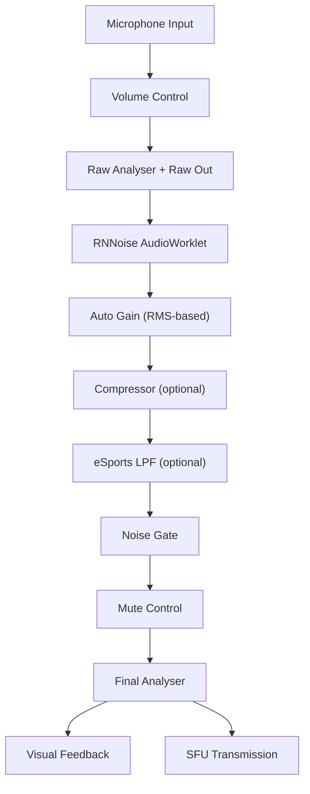
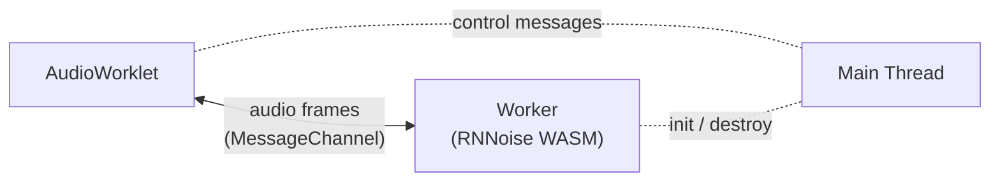
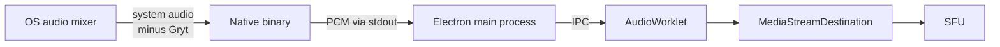

The client implements a multi-stage audio processing pipeline built entirely on the Web Audio API. Each stage is a native `AudioNode` (or `AudioWorkletNode`) connected in series, so processing runs off the main thread with minimal latency.

## Key Features

### Enhanced Audio Pipeline
- **Multi-stage Processing**: Volume → RNNoise → AGC → Compressor → eSports filter → Noise Gate → Mute → Output
- **Real-time Audio Visualization**: Frequency spectrum and level meters
- **Loopback Monitoring**: Hear yourself to test audio setup
- **Device Management**: Hot-swappable microphone and speaker selection

### Audio Quality Optimization
- **RNNoise Noise Reduction**: AI-powered noise suppression via AudioWorklet (~20 ms latency)
- **True Auto Gain Control**: RMS-based level normalization with configurable target dB
- **Dynamic Range Compressor**: Separate compressor stage with adjustable amount
- **Noise Gate Filtering**: Configurable threshold with smooth curves
- **Echo Cancellation**: Browser-level AEC via `getUserMedia` constraints

### Professional Controls
- **Volume Controls**: Independent microphone and output volume with 2x boost
- **Real-time Adjustment**: Instant response without audio glitches
- **Visual Feedback**: Accurate representation of transmitted audio
- **Device Hot-swapping**: Change devices without connection loss

## Audio Processing Pipeline

The client chains native Web Audio nodes in a single `AudioContext`:

### Stage 1: Volume Control

A `GainNode` with 0–200 % range (2x boost). Logarithmic scaling maps the slider to a natural loudness curve.

### Stage 2: RNNoise Noise Reduction (AudioWorklet)

When enabled, audio is routed through an `AudioWorkletNode` running RNNoise compiled to WebAssembly. The worklet processes 480-sample frames (10 ms at 48 kHz) in a dedicated thread, adding roughly **20 ms** of latency.

Audio frames flow directly between the AudioWorklet and the RNNoise Web Worker via a `MessageChannel`, completely bypassing the main thread. This prevents UI freezes that would otherwise occur from relaying ~200 message events per second through the main thread event loop.

| Property | Value |
|----------|-------|
| Frame size | 480 samples (10 ms) |
| Sample rate | 48 kHz |
| Processing thread | AudioWorklet + Worker (off main thread) |
| Main thread involvement | Control messages only (enable/disable) |
| Typical added latency | ~20 ms |

### Stage 3: Auto Gain Control (True AGC)

A true RMS-based AGC that continuously measures input loudness and adjusts a `GainNode` to hit a configurable target level. This replaces the previous `DynamicsCompressorNode` hack.

**Settings:**
- **Target Level**: -30 dB to -5 dB (default -20 dB) — the volume your voice gets normalized to
- **Enabled by default**: Yes

The AGC analyser measures RMS in real-time and the gain node is adjusted dynamically in `usePipelineControls` to converge on the target dB level.

### Stage 4: Compressor

An optional `DynamicsCompressorNode` that tames dynamic peaks after AGC. Useful for keeping volume consistent when speaking softly then loudly.

**Settings:**
- **Enabled by default**: Yes
- **Amount**: 0–100 % slider that interpolates compressor parameters from gentle to aggressive

| Amount | Threshold | Knee | Ratio | Attack | Release |
|--------|-----------|------|-------|--------|---------|
| 0 % | -10 dB | 40 | 2:1 | 0.01 s | 0.25 s |
| 100 % | -50 dB | 5 | 20:1 | 0.001 s | 0.05 s |

### Stage 5: eSports Low-pass Filter (Optional)

When eSports mode is enabled, a `BiquadFilterNode` (lowpass, 3400 Hz cutoff) rolls off high-frequency content to prioritize vocal clarity over fidelity, matching competitive voice chat conventions.

### Stage 6: Noise Gate

A `GainNode` controlled by the raw analyser's RMS level. When input falls below the configurable threshold, the gate closes smoothly. The raw analyser taps the signal **before** RNNoise so the gate responds to actual mic input, not processed audio.

**Configuration:**
- **Threshold**: -50 dB to -10 dB (configurable via slider)
- **Behavior**: Smooth open/close to avoid clicks

### Stage 7: Mute Control

Server-synchronized mute via a `GainNode` set to 0. State is synced bidirectionally with the signaling server so other participants see the correct mute indicator.

### Stage 8: Final Analysis + SFU Transmission

The final analyser provides real-time visual feedback (level meters, frequency spectrum). The output is connected to a `MediaStreamDestination` for WebRTC transmission to the SFU.

## Screen Share Audio — Native Capture

When screen sharing with system audio, Gryt uses **OS-native per-process audio capture** on the desktop app to exclude its own audio from the stream. This means other participants hear your game, music, or application audio — but not the voices of people already in the call.

### How it works

- **Windows** (10 build 20348+): Uses the WASAPI `PROCESS_LOOPBACK_MODE_EXCLUDE_TARGET_PROCESS_TREE` API to capture all system audio except Gryt's process tree.
- **macOS** (13.0+): Uses ScreenCaptureKit with `excludesCurrentProcessAudio` to exclude the current app's audio.
- **Linux / Web**: No OS-level API is available. Screen share audio is passed through unfiltered.

The native binary is a small standalone executable shipped alongside the Electron app. It writes raw 48 kHz 16-bit stereo PCM to stdout; the main process forwards chunks to the renderer via IPC, where an `AudioWorkletNode` converts them into a `MediaStreamTrack` for WebRTC transmission.

### Platform support

| Platform | Method | Gryt audio excluded? |
|----------|--------|---------------------|
| Windows (desktop app) | WASAPI process loopback | Yes |
| macOS (desktop app) | ScreenCaptureKit | Yes |
| Linux (desktop app) | System loopback | No |
| Web (any OS) | `getDisplayMedia` | No |

## Settings Reference

All audio settings are persisted to `localStorage` and take effect immediately:

| Setting | Default | Range | Description |
|---------|---------|-------|-------------|
| Microphone Volume | 100 % | 0–200 % | Input gain with 2x boost capability |
| Output Volume | 100 % | 0–200 % | Speaker / headphone volume |
| Noise Gate Threshold | -30 dB | -50 to -10 dB | Below this level, mic is gated |
| RNNoise | Off | On / Off | AI noise reduction via AudioWorklet |
| Auto Gain | On | On / Off | RMS-based level normalization |
| AGC Target Level | -20 dB | -30 to -5 dB | Target loudness for auto gain |
| Compressor | On | On / Off | Dynamic range compression after AGC |
| Compressor Amount | 50 % | 0–100 % | Gentle → aggressive compression |
| eSports Mode | Off | On / Off | 3.4 kHz low-pass for vocal clarity |
| Loopback | Off | On / Off | Monitor your processed audio locally |

## Loopback Monitoring

Toggle loopback in Audio Settings to route your fully-processed audio to your speakers/headphones. Useful for verifying how you sound to others before joining a voice channel.

## Device Management

Microphone and speaker devices can be changed at any time through Audio Settings without disconnecting from voice. The client listens for `devicechange` events and automatically refreshes the device list. If your selected device is unplugged, it falls back to the system default.

## Troubleshooting

### Common Audio Processing Issues

**RNNoise causing artifacts?**
- Disable RNNoise in Audio Settings — it is experimental and may not work well on all systems
- Ensure your browser supports `AudioWorklet` (all modern browsers do)
- Check for high CPU usage; RNNoise adds a constant processing load

**Auto gain too loud or too quiet?**
- Adjust the AGC target level slider (lower = quieter, higher = louder)
- If your mic has very low input, combine with the Volume slider boost

**Compressor squashing too much?**
- Lower the Compressor Amount slider or disable it entirely
- The compressor works best when paired with Auto Gain

**Noise gate cutting off speech?**
- Lower the noise gate threshold so quieter speech isn't gated
- If using RNNoise, you may not need an aggressive noise gate at all

**Device switching issues?**
- Check browser permissions for microphone access
- Some devices require a page reload after plugging in
- Try selecting "Default" before choosing a specific device

## Performance Metrics

| Metric | Target |
|--------|--------|
| Pipeline latency (no RNNoise) | < 5 ms |
| Pipeline latency (with RNNoise) | ~20 ms |
| CPU usage (audio processing) | < 5 % |
| RNNoise WASM memory | ~2 MB |
| Buffer underruns | < 0.1 % |
