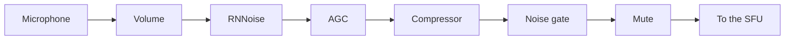

import { Callout } from 'fumadocs-ui/components/callout';

Capture runs at 48 kHz through a chain of Web Audio nodes. Every stage after the
volume control is optional, and each one can be turned off on its own from
**Settings → Audio**.

```mermaid
graph LR
  Mic["Microphone"] --> Vol["Volume"]
  Vol --> RNN["RNNoise"]
  RNN --> AGC["AGC"]
  AGC --> Comp["Compressor"]
  Comp --> Gate["Noise gate"]
  Gate --> Mute["Mute"]
  Mute --> Out["To the SFU"]
```

Mute sits last on purpose. Nothing upstream of it can defeat it, so muting is
muting regardless of what the rest of the chain is doing.

## Volume

A `GainNode` on the raw input. This is also the tap the noise gate measures
against, which matters later.

## RNNoise

Neural noise suppression, running as an `AudioWorkletNode` rather than on the
main thread. It removes keyboard clatter, fans and background hum while leaving
speech alone.

If the worklet fails to connect, the error is logged and the chain carries on
without it rather than failing to produce audio at all.

## Automatic gain control

An `AnalyserNode` at 2048 FFT with smoothing set to zero, feeding a `GainNode`.
Zero smoothing means it reacts to the level it just measured rather than to a
rolling average, which is what makes it track a voice that moves closer to and
further from the microphone.

## Compressor

A `DynamicsCompressorNode`, controlled by a single **Amount** slider from 0 to
100. The slider interpolates three of the five parameters:

| Amount | Threshold | Knee | Ratio |
|--------|-----------|------|-------|
| 0 | -10 dB | 40 | 1:1 |
| 50 | -25 dB | 22.5 | 10.5:1 |
| 100 | -40 dB | 5 | 20:1 |

Attack stays at 3 ms and release at 250 ms throughout.

## Noise gate

Also an `AudioWorkletNode`, which is deliberate: a worklet keeps running when the
window is hidden, and a gate that stops working when you tab away is worse than
no gate.

The threshold is a percentage from 0 to 100, not a decibel figure. Audio below it
is silenced.

The interesting part is what it measures. The gate takes its signal from the
processing chain but its *threshold reference* from a tap taken before RNNoise,
AGC and the compressor. Measuring a post-chain level against a threshold the
user set while watching a pre-chain meter would quietly change what their number
means.

Release time is configurable. Smoothing is 0.8 normally and 0.3 in eSports mode.

<Callout title="Push-to-talk turns the gate off">
With push-to-talk selected the threshold is set to 0, which disables gating
entirely. The gating is done by the mute node instead, since that is exactly what
push-to-talk is. The noise gate slider is hidden in that mode rather than
sitting there doing nothing.
</Callout>

## Mute

A `GainNode` at zero. The state is synchronised with the server in both
directions, so what other people see on your name matches what your microphone is
actually doing, including when a moderator mutes you.

## Output

A final `AnalyserNode` drives the level meters, and a `MediaStreamDestination`
hands the result to WebRTC.

There is a separate monitor tap before the mute node, which is what loopback
monitoring listens to. That placement means you hear yourself as others would,
minus the mute.

## eSports mode

One toggle in **Settings → Voice** that trades processing for latency:

- RNNoise off
- Noise gate bypassed
- Push-to-talk enabled
- Bitrate capped at 128 kbps
- Opus packetisation set to 10 ms frames

The frame size is where most of the gain is. Shorter frames mean less time spent
filling a packet before it can be sent.

## Screen share audio on the desktop

Capturing system audio without also capturing Gryt's own output is not something
the browser APIs will do. The desktop app runs a native binary that excludes
Gryt's process tree, writes raw PCM to stdout, and hands it to the Electron main
process. That forwards chunks over IPC to the renderer, where an
`AudioWorkletNode` turns the stream back into a `MediaStreamTrack` WebRTC can
send.

## Devices

Input and output devices are chosen in **Settings → Audio** and remembered in
`localStorage` along with volume, gate threshold and every toggle above. None of
it is server-side, so it follows the installation rather than the account.

## When something sounds wrong

**Others hear themselves when you share audio.** The capture is picking up your
speakers or including Gryt's own output. Use the desktop app's native capture
rather than a browser tab, or headphones.

**Your voice cuts off at the start of words.** The gate threshold is too high, or
its release is too short. Watch the raw input meter next to the slider and set
the threshold below where your quiet speech sits.

**Your level pumps up and down.** AGC and a heavy compressor setting fighting
each other. Turn the compressor amount down first.

**Nothing is transmitted at all.** Check the mute state, then that the right
input device is selected, then browser microphone permission. The level meter
shows raw input, so a meter that moves while nobody hears you points downstream
of capture, most often the gate.

For anything that looks like a connection problem rather than an audio one, the
[voice debugging page](/docs/sfu/voice-debugging) is the better place.
