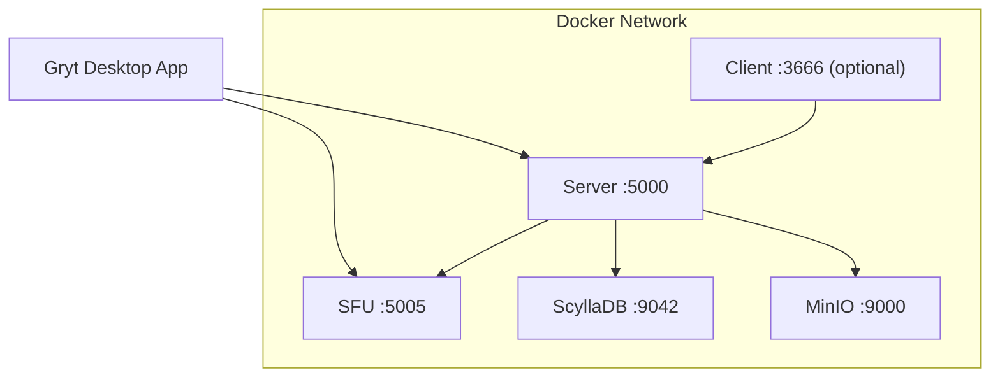

import { Callout } from 'fumadocs-ui/components/callout';
import { Step, Steps } from 'fumadocs-ui/components/steps';
import { Tab, Tabs } from 'fumadocs-ui/components/tabs';

The fastest way to self-host Gryt. Everything runs from pre-built images published to
GitHub Container Registry — no need to clone any repos or build anything.

## What's included

| Service | Image | Purpose | Required? |
|---------|-------|---------|-----------|
| **Server** | `ghcr.io/gryt-chat/server` | Signaling, chat, file uploads | Yes |
| **SFU** | `ghcr.io/gryt-chat/sfu` | WebRTC media forwarding | Yes |
| **ScyllaDB** | `scylladb/scylla` | Message & user storage | Yes |
| **MinIO** | `minio/minio` | S3-compatible file storage | Yes |
| **Client** | `ghcr.io/gryt-chat/client` | Web UI (React + Nginx) | Optional |
| **Prometheus** | `prom/prometheus` | Metrics collection | Optional |
| **Grafana** | `grafana/grafana` | Metrics dashboards | Optional |

Most users connect via the [Gryt desktop app](https://github.com/Gryt-chat/gryt/releases) (available for Linux, macOS, and Windows).
The web client is optional and only needed if you want browser-based access.

## Quick start

<Steps>

<Step>
### Download the compose file and example env

<Tabs items={["curl", "wget"]}>
<Tab value="curl">
```bash
mkdir gryt && cd gryt
curl -LO https://raw.githubusercontent.com/Gryt-chat/gryt/main/docker-compose.yml
curl -LO https://raw.githubusercontent.com/Gryt-chat/gryt/main/.env.example
cp .env.example .env
```
</Tab>
<Tab value="wget">
```bash
mkdir gryt && cd gryt
wget https://raw.githubusercontent.com/Gryt-chat/gryt/main/docker-compose.yml
wget https://raw.githubusercontent.com/Gryt-chat/gryt/main/.env.example
cp .env.example .env
```
</Tab>
</Tabs>

</Step>

<Step>
### Edit the `.env` file

Open `.env` in your editor and configure at minimum:

```bash
# Give your server a name
SERVER_NAME=My Gryt Server

# Set a real secret in production
JWT_SECRET=<run: openssl rand -base64 48>

# Allowed origins (desktop app + hosted web client + local web client)
CORS_ORIGIN=http://127.0.0.1:15738,http://localhost:3666,https://app.gryt.chat
```

</Step>

<Step>
### Start the server

```bash
docker compose up -d
```

This starts the core services: **Server**, **SFU**, **ScyllaDB**, and **MinIO**.
Wait about 30–60 seconds for ScyllaDB to initialize, then connect with the
[Gryt desktop app](https://github.com/Gryt-chat/gryt/releases) or [app.gryt.chat](https://app.gryt.chat).

**Invite-only**: the **first user** to join a brand-new server becomes the **owner/admin** automatically.
After that, the server is **invite-only**. Create invite links in **Server settings → Invites** and share them.

To also run the web client (optional):

```bash
docker compose --profile web up -d
```

The web client will be available at [http://localhost:3666](http://localhost:3666).

</Step>

</Steps>

## Architecture



## Configuration reference

### Image versions

Images default to `latest`. Pin a specific version for reproducible deploys:

```bash
SERVER_VERSION=x.y.z
SFU_VERSION=x.y.z
CLIENT_VERSION=x.y.z  # only if using --profile web
```

Browse available tags at [github.com/orgs/gryt-chat/packages](https://github.com/orgs/gryt-chat/packages).

### Ports

| Variable | Default | Description |
|----------|---------|-------------|
| `SERVER_PORT` | `5000` | Signaling API + WebSocket |
| `CLIENT_PORT` | `3666` | Web UI (only with `--profile web`) |
| `SFU_PORT` | `5005` | SFU WebSocket |
| `ICE_UDP_MUX_PORT` | `443` | **Recommended**: run WebRTC over a single UDP port (open UDP 443) |
| `SFU_UDP_MIN` | `10000` | WebRTC UDP range start (if not using `ICE_UDP_MUX_PORT`) |
| `SFU_UDP_MAX` | `10019` | WebRTC UDP range end (if not using `ICE_UDP_MUX_PORT`) |

### Server

| Variable | Default | Description |
|----------|---------|-------------|
| `SERVER_NAME` | `My Gryt Server` | Display name in the server browser |
| `SERVER_DESCRIPTION` | `A Gryt voice chat server` | Server description |
| `SERVER_PASSWORD` | *(empty)* | Optional server↔SFU shared secret (**not** a user join password) |
| `SERVER_INVITE_MAX_RETRIES` | `8` | Invalid invite attempts before lockout (per IP+user) |
| `SERVER_INVITE_RETRY_WINDOW_MS` | `300000` | Sliding window for attempt counting (5 min) |
| `SERVER_INVITE_RETRY_COOLDOWN_MS` | `60000` | Base cooldown after lockout (1 min) |
| `SERVER_INVITE_MAX_COOLDOWN_MS` | `3600000` | Cooldown escalation cap (1 hour) |
| `SERVER_INVITE_IP_MAX_RETRIES` | `20` | Per-IP invalid invite attempts before lockout |
| `VOICE_MAX_USERS` | *(auto)* | Optional voice seat limit override |
| `REFRESH_TOKEN_TTL_DAYS` | `7` | Refresh token lifetime (days) |
| `JWT_SECRET` | `change-me-in-production` | Session token secret |
| `CORS_ORIGIN` | see below | Allowed origins (comma-separated). Always include `http://127.0.0.1:15738` (desktop app) and `https://app.gryt.chat` (web client) |

If you set `SERVER_PASSWORD`, keep it stable. Changing it may require restarting the SFU, because the SFU caches the password per server ID.

### Changing the server owner (CLI)

The **first user** to join a brand-new server becomes the **owner/admin** automatically.

To change the owner later, run:

```bash
docker compose exec server node dist/admin/setOwner.js --grytUserId <keycloak_sub>
```

### Authentication

| Variable | Default | Description |
|----------|---------|-------------|
| `GRYT_AUTH_MODE` | `disabled` | `disabled` or `required` |
| `GRYT_OIDC_ISSUER` | `https://auth.gryt.chat/realms/gryt` | OIDC issuer URL |
| `GRYT_OIDC_AUDIENCE` | `gryt-web` | OIDC audience |

### WebRTC / NAT

| Variable | Default | Description |
|----------|---------|-------------|
| `STUN_SERVERS` | Google STUN | Comma-separated STUN URIs |
| `SFU_PUBLIC_HOST` | `ws://localhost:5005` | Public SFU URL(s) for browsers (comma-separated for multi-network) |
| `SFU_ADVERTISE_IP` | *(auto)* | Public IP(s) to advertise in ICE candidates (comma-separated for multi-network) |

### Storage

| Variable | Default | Description |
|----------|---------|-------------|
| `MINIO_ROOT_USER` | `minioadmin` | MinIO admin username |
| `MINIO_ROOT_PASSWORD` | `minioadmin` | MinIO admin password |
| `S3_BUCKET` | `gryt` | Bucket for file uploads |

## Production checklist

<Callout type="warn" title="Before going public">
- [ ] Set a strong `JWT_SECRET` — generate with `openssl rand -base64 48`
- [ ] Change `MINIO_ROOT_USER` and `MINIO_ROOT_PASSWORD`
- [ ] Open **UDP 443** for the SFU (recommended), or open UDP `10000-10019` if using the high-port range
- [ ] Set `SFU_ADVERTISE_IP` if behind NAT
- [ ] Set `SFU_PUBLIC_HOST` to your public `wss://` URL
- [ ] Ensure `CORS_ORIGIN` includes `http://127.0.0.1:15738` (desktop app), `https://app.gryt.chat` (web client), and your production domain
- [ ] Put a reverse proxy (Caddy, Nginx, Traefik) in front for TLS
- [ ] Pin image versions instead of `latest`
</Callout>

### TLS with Caddy (recommended)

The simplest way to add HTTPS is [Caddy](https://caddyserver.com/) — it handles certificates automatically.

Add this to your `docker-compose.yml`:

```yaml
services:
  caddy:
    image: caddy:latest
    container_name: gryt-caddy
    ports:
      - "80:80"
      - "443:443"
    volumes:
      - ./Caddyfile:/etc/caddy/Caddyfile:ro
      - caddy-data:/data
    networks:
      - gryt
    restart: unless-stopped

volumes:
  caddy-data:
```

And create a `Caddyfile`:

```
gryt.example.com {
    reverse_proxy client:80
}

api.example.com {
    reverse_proxy server:5000
}

sfu.example.com {
    reverse_proxy sfu:5005
}
```

Then update your `.env`:

```bash
CORS_ORIGIN=http://127.0.0.1:15738,https://app.gryt.chat,https://gryt.example.com
SFU_PUBLIC_HOST=wss://sfu.example.com
CLIENT_PORT=8080  # Caddy takes over port 80/443

# Multi-network example (LAN party + public):
# SFU_PUBLIC_HOST=wss://sfu.example.com,ws://192.168.1.100:5005
# SFU_ADVERTISE_IP=203.0.113.10,192.168.1.100
```

## LAN optimization

<Callout type="info" title="Hosting for a LAN party or local network?">
Add your server's LAN IP to `SFU_ADVERTISE_IP` and `SFU_PUBLIC_HOST` so clients on the same
network connect directly — skipping external STUN entirely for near-zero-latency voice.
</Callout>

```bash
# Your server's LAN IP (find it with: hostname -I | awk '{print $1}')
SFU_ADVERTISE_IP=192.168.1.100
SFU_PUBLIC_HOST=ws://192.168.1.100:5005
```

For mixed setups where some users are on the LAN and others connect over the internet, use
comma-separated values. The client automatically pings each SFU endpoint and picks the fastest:

```bash
SFU_ADVERTISE_IP=203.0.113.10,192.168.1.100
SFU_PUBLIC_HOST=wss://sfu.example.com,ws://192.168.1.100:5005
```

## Managing the stack

```bash
# View logs
docker compose logs -f

# View logs for a single service
docker compose logs -f server

# Restart a service after config change
docker compose restart server

# Update to latest images
docker compose pull && docker compose up -d

# Same, but include the web client
docker compose --profile web pull && docker compose --profile web up -d

# Update a single service to a specific version
SFU_VERSION=x.y.z docker compose up -d sfu

# Stop everything
docker compose down

# Stop and remove all data (clean slate)
docker compose down -v
```

## Health checks

All services expose health endpoints. Check the stack health:

```bash
curl http://localhost:5000/health   # server
curl http://localhost:5005/health   # sfu
curl http://localhost:3666/health   # client (only with --profile web)
```

Or use `docker compose ps` to see the health status of all containers.

## Monitoring

Both the Server and SFU expose Prometheus metrics at `/metrics`. Enable the
optional monitoring stack (Prometheus + Grafana) with:

```bash
docker compose --profile monitoring up -d
```

Grafana is available at [http://localhost:3000](http://localhost:3000) (default login: `admin` / `admin`).

See the full [Monitoring guide](/docs/deployment/monitoring) for configuration, available metrics, and recommended dashboards.

## Upgrading

```bash
# Pull the latest images
docker compose pull

# Recreate containers with new images
docker compose up -d

# Verify
docker compose ps
```

To upgrade to specific versions, edit the `*_VERSION` vars in `.env`:

```bash
SERVER_VERSION=x.y.z
SFU_VERSION=x.y.z
CLIENT_VERSION=x.y.z  # only if using --profile web
```

Then run `docker compose up -d`.

## Using external S3 / database

To use an external S3-compatible provider (AWS, Cloudflare R2, etc.) or an external ScyllaDB/Cassandra cluster, remove the
`scylla`, `minio`, and `minio-init` services from `docker-compose.yml` and set the appropriate environment variables on the
`server` service directly:

```yaml
server:
  environment:
    # External ScyllaDB
    SCYLLA_CONTACT_POINTS: "your-scylla-host:9042"
    SCYLLA_KEYSPACE: gryt

    # External S3 (e.g. Cloudflare R2)
    S3_ENDPOINT: "https://<account-id>.r2.cloudflarestorage.com"
    S3_REGION: auto
    S3_ACCESS_KEY_ID: "<your-key>"
    S3_SECRET_ACCESS_KEY: "<your-secret>"
    S3_BUCKET: gryt
    S3_FORCE_PATH_STYLE: "false"
```
