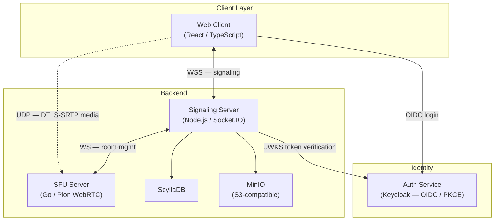
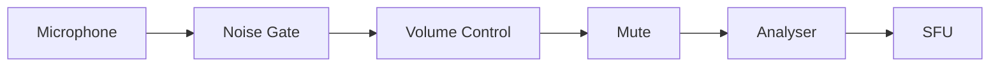
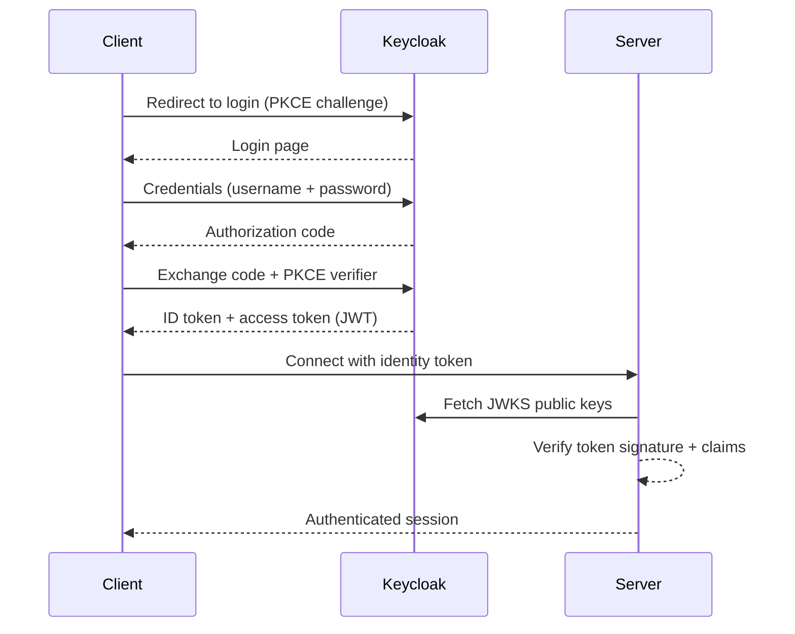
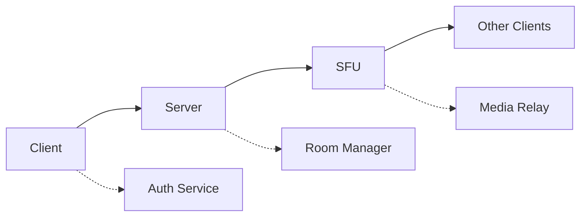

Gryt follows a microservices architecture with four components:



## Web Client

```
packages/client/src/
├── packages/
│   ├── audio/          # Audio processing and device management
│   │   ├── hooks/      # useMicrophone, useAudioDevices
│   │   ├── processors/ # Noise gate, volume control
│   │   └── visualization/
│   ├── webRTC/         # SFU connection and WebRTC handling
│   │   ├── hooks/      # useSFU, usePeerConnection
│   │   ├── connection/
│   │   └── signaling/
│   ├── socket/         # Server communication
│   │   ├── hooks/      # useSockets, useServerState
│   │   ├── components/ # Server list, user list
│   │   └── types/
│   └── settings/       # Configuration and preferences
├── components/         # Shared UI components (Radix UI)
├── hooks/              # Global React hooks
└── types/              # TypeScript type definitions
```

### Audio processing pipeline



State management uses React hooks and context. Audio settings (volume, noise gate, device) are stored in `localStorage` and synced via custom hooks.

### Screen share audio (Electron)

On the desktop app, screen share audio uses a native binary to capture system audio while excluding Gryt's own process tree. The binary communicates with the Electron main process via stdin/stdout (raw PCM), which forwards audio chunks to the renderer via IPC. An `AudioWorkletNode` converts the PCM stream into a `MediaStreamTrack` for WebRTC. See [Audio Processing](/docs/client/audio-processing#screen-share-audio--native-capture) for details.

## Signaling Server

```
packages/server/src/
├── socket/        # Socket.IO server, handlers, auth middleware, server state sync
│   ├── handlers/  # server:join, chat:*, voice:*, admin:*, etc.
│   ├── middleware/# accessToken validation + role enforcement
│   └── utils/     # server details, client sync helpers
├── routes/        # REST API endpoints (messages, uploads, members, emojis, etc.)
├── db/            # ScyllaDB access layer (users, messages, roles, invites, ...)
├── auth/          # OIDC identity token verification (JWKS)
├── storage/       # S3/MinIO integration
├── jobs/          # background workers (media sweep, emoji queue)
├── sfu/           # SFU client (server↔SFU sync)
└── utils/         # jwt, rate limiter, profanity filter, server ID helpers
```

### Room management

Rooms are created on first join and cleaned up when empty. Room IDs are prefixed with the server name to prevent cross-server collisions:

```typescript
const createRoomId = (serverName: string, channelId: string): string => {
  const prefix = serverName.split('.')[0];
  return `${prefix}_${channelId}`;
};
```

## SFU Server

```
packages/sfu/
├── cmd/sfu/           # Entry point
├── internal/
│   ├── config/        # Environment-based configuration
│   ├── websocket/     # Thread-safe WebSocket wrapper
│   ├── webrtc/        # Peer connection management
│   ├── track/         # Media track lifecycle
│   └── signaling/     # Signaling coordination
└── pkg/types/         # Shared message structures
```

### Selective forwarding

The SFU receives audio tracks from each participant and forwards them to every other peer in the room -- no transcoding, minimal latency:

```go
func (r *Room) ForwardTrack(track *Track) {
    r.mutex.RLock()
    defer r.mutex.RUnlock()

    for peerID, peer := range r.Peers {
        if peerID != track.PeerID {
            peer.ForwardTrack(track)
        }
    }
}
```

## Authentication

Authentication uses a centrally hosted Keycloak instance. Clients authenticate via OIDC Authorization Code + PKCE (public client, no client secret). Servers validate tokens by checking the JWT signature against the Keycloak JWKS endpoint -- no shared secret with Gryt is required.



## Data flow



1. Client authenticates with Keycloak and gets a JWT
2. Client opens a WebSocket to the signaling server (JWT in handshake)
3. On voice channel join, the server requests a room from the SFU
4. SFU sends a WebRTC offer; the client answers
5. ICE candidates are exchanged via the signaling server
6. Media flows directly between client and SFU over UDP

## Deployment

| Stack | Path | Use case |
|-------|------|----------|
| Cloudflare Tunnel | `ops/deploy/host/compose.yml` | Hosting with Tunnel + DB + S3 |
| Production | `ops/deploy/compose/prod.yml` | Behind a reverse proxy |
| Dev | `ops/deploy/compose/dev.yml` | Local development |
| Kubernetes | `ops/helm/gryt/` | Helm chart |

See the [Deployment](/docs/deployment) section for details.

## Scalability

- **SFU**: Multiple instances behind a load balancer
- **Signaling server**: Multiple instances with session affinity
- **Database**: ScyllaDB with per-server keyspaces
- **Storage**: S3-compatible object storage
