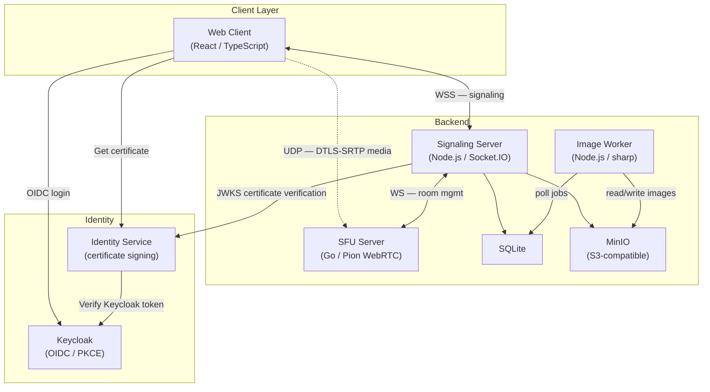
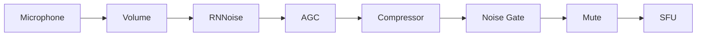
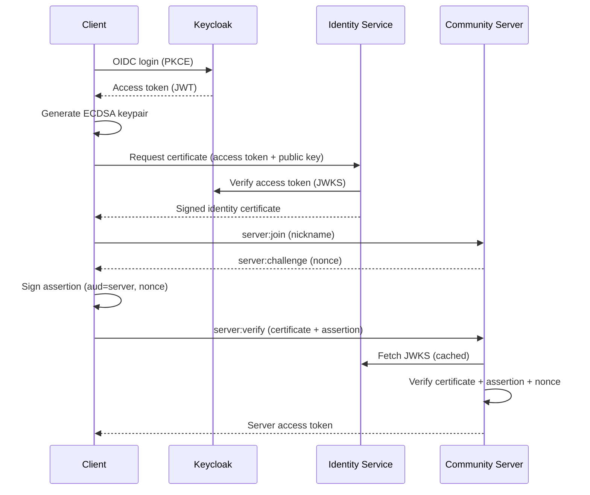
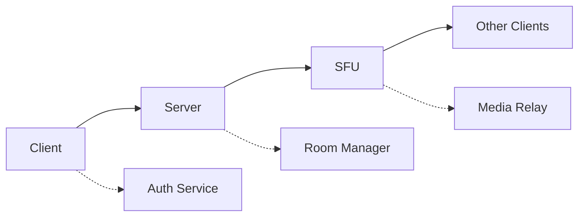

Gryt follows a microservices architecture:



## Web Client

```
packages/client/src/
├── packages/
│   ├── audio/          # Audio processing and device management
│   │   └── hooks/      # useMicrophone, usePushToTalk, usePipelineControls
│   ├── webRTC/         # SFU connection and WebRTC handling
│   │   └── hooks/      # useSFU, sfuConnection, sfuConnectFlow
│   ├── socket/         # Server communication
│   │   ├── hooks/      # useSockets, useServerState, useServerManagement
│   │   └── components/ # Server list, member sidebar
│   ├── settings/       # Configuration, theme, server management
│   ├── common/         # Auth (Keycloak), shared hooks, utils
│   └── dialogues/      # Dialog components
├── components/         # Shared UI components (Radix Themes)
├── lib/                # Utility modules (electron, theme, etc.)
└── assets/             # Fonts, images
```

### Audio processing pipeline



State management uses React hooks and context. Audio settings (volume, noise gate, device) are stored in `localStorage` and synced via custom hooks.

### Screen share audio (Electron)

On the desktop app, screen share audio uses a native binary to capture system audio while excluding Gryt's own process tree. The binary communicates with the Electron main process via stdin/stdout (raw PCM), which forwards audio chunks to the renderer via IPC. An `AudioWorkletNode` converts the PCM stream into a `MediaStreamTrack` for WebRTC. See [Audio Processing](/docs/client/audio-processing#screen-share-audio--native-capture) for details.

## Signaling Server

```
packages/server/src/
├── socket/        # Socket.IO server, handlers, auth middleware, server state sync
│   ├── handlers/  # server:join, chat:*, voice:*, admin:*, etc.
│   ├── middleware/# accessToken validation + role enforcement
│   └── utils/     # server details, client sync helpers
├── routes/        # REST API endpoints (messages, uploads, members, emojis, etc.)
├── db/            # SQLite access layer (users, messages, roles, invites, ...)
├── auth/          # Identity certificate & assertion verification (JWKS)
├── storage/       # S3/MinIO integration
├── jobs/          # background workers (media sweep, emoji queue; image compression runs in the separate image-worker service)
├── sfu/           # SFU client (server↔SFU sync)
└── utils/         # jwt, rate limiter, profanity filter, server ID helpers
```

### Room management

Rooms are created on first join and cleaned up when empty. Room IDs are constructed from the server name, port, and channel ID to prevent cross-server collisions in the SFU.

## SFU Server

```
packages/sfu/
├── cmd/sfu/           # Entry point
├── internal/
│   ├── config/        # Environment-based configuration
│   ├── websocket/     # Thread-safe WebSocket wrapper
│   ├── webrtc/        # Peer connection management
│   ├── track/         # Media track lifecycle
│   └── signaling/     # Signaling coordination
└── pkg/types/         # Shared message structures
```

### Selective forwarding

The SFU receives audio, video, and screen-share tracks from each participant and forwards them to every other peer in the room without transcoding. Track management lives in `internal/track/manager.go`. Receiver RTCP feedback (PLI, REMB) is relayed back to senders so their congestion controllers can adapt bitrate in real time.

## Image Worker

A standalone service that handles image compression and thumbnail generation, keeping `sharp` (native image processing) out of the signaling server so that a corrupt image cannot crash the main process.

```
packages/image-worker/
├── src/
│   ├── index.ts         # Entry point, polling loop, health server
│   ├── processImage.ts  # sharp compression + AVIF thumbnail generation
│   ├── storage.ts       # S3 client (get / put / delete)
│   └── db.ts            # SQLite queries (image jobs, file records)
└── Dockerfile
```

The worker polls the `image_jobs` table for queued entries. For each job it fetches the raw upload from S3, compresses to AVIF when it exceeds the server size limit, generates a 320 px thumbnail, writes the results back to S3, and updates the file record in the database.

## Authentication

Authentication uses two services: **Keycloak** for login and a lightweight **Identity Service** for certificate signing.

Clients authenticate with Keycloak via OIDC Authorization Code + PKCE (public client, no client secret). After login, the client generates an ECDSA P-256 keypair and obtains a **signed certificate** from the Identity Service that binds the public key to the user's Gryt identity.

When joining a community server, the client uses a **challenge-response** protocol — the Keycloak token is never sent to the server. This prevents malicious server operators from stealing and replaying credentials.



See the [Security](/docs/guide/security) page for a detailed breakdown of this flow and its security properties.

## Data flow



1. Client authenticates with Keycloak and obtains a certificate from the Identity Service
2. Client opens a WebSocket to the signaling server and completes challenge-response
3. Server issues a server-scoped access token
4. On voice channel join, the server requests a room from the SFU
5. SFU sends a WebRTC offer; the client answers
6. ICE candidates are exchanged via the signaling server
7. Media flows directly between client and SFU over UDP

## Deployment

| Stack | Path | Use case |
|-------|------|----------|
| Cloudflare Tunnel | `ops/deploy/host/compose.yml` | Hosting with Tunnel + DB + S3 |
| Production | `ops/deploy/compose/prod.yml` | Behind a reverse proxy |
| Dev | `ops/deploy/compose/dev.yml` | Local development |
| Kubernetes | `ops/helm/gryt/` | Helm chart |

See the [Deployment](/docs/deployment) section for details.

## Scalability

- **SFU**: Multiple instances behind a load balancer
- **Signaling server**: Multiple instances with session affinity
- **Database**: SQLite (single-file database per server data directory)
- **Storage**: S3-compatible object storage
