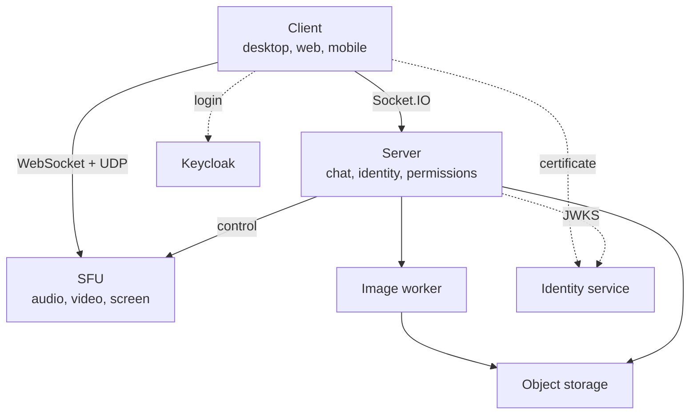
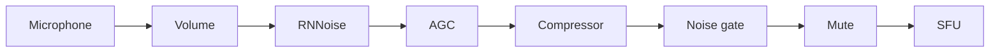
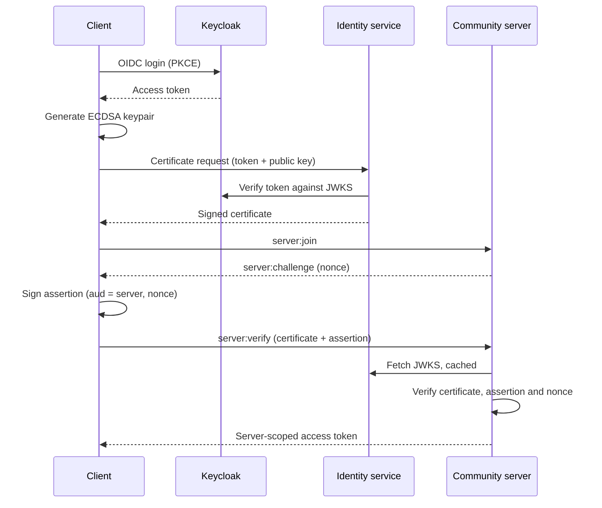

Gryt splits into two planes that barely talk to each other. The server knows who
people are and what they said. The SFU moves audio and video and knows neither.

That split is the reason a community server can be somebody's spare machine: it
handles text, presence and permissions, which are cheap, and hands the expensive
part to a service that does one thing.


```mermaid
graph TB
  C["Client<br/>desktop, web, mobile"]
  S["Server<br/>chat, identity, permissions"]
  SFU["SFU<br/>audio, video, screen"]
  IW["Image worker"]
  OS["Object storage"]
  K["Keycloak"]
  ID["Identity service"]

  C -->|"Socket.IO"| S
  C -->|"WebSocket + UDP"| SFU
  S -->|"control"| SFU
  S --> IW
  IW --> OS
  S --> OS
  C -.->|"login"| K
  C -.->|"certificate"| ID
  S -.->|"JWKS"| ID
```

## The client

Electron on the desktop, the same React app in a browser, and a React Native app
on phones. State lives in hooks and context; audio settings are kept in
`localStorage`.

### Audio

Capture runs at a fixed 48 kHz through a chain of Web Audio nodes:


```mermaid
graph LR
  Mic["Microphone"] --> Vol["Volume"]
  Vol --> RNN["RNNoise"]
  RNN --> AGC["AGC"]
  AGC --> Comp["Compressor"]
  Comp --> Gate["Noise gate"]
  Gate --> Mute["Mute"]
  Mute --> SFU
```

Each stage can be turned off independently, and the mute node is last so that
muting cannot be defeated by anything upstream of it.

### Screen share audio on the desktop

Capturing system audio without capturing Gryt's own output needs more than the
browser offers, so the desktop app shells out to a native binary that excludes
Gryt's process tree. It writes raw PCM to stdout, the Electron main process
forwards chunks over IPC, and an `AudioWorkletNode` turns the stream back into a
`MediaStreamTrack` WebRTC can send. Details on the
[audio processing page](/docs/client/audio-processing#screen-share-audio--native-capture).

## The server

Express for HTTP, Socket.IO for everything interactive, SQLite through
`node:sqlite` for storage. One process per community.

Almost nothing goes over REST. Uploads and downloads do, because they want plain
HTTP caching, and so does the join preview. Chat, presence, voice signalling,
moderation and settings are all socket events: fifty-eight handlers, listed in
the [API reference](/docs/server/api-reference).

### Two room identifiers

A voice channel has two names and they are not interchangeable:

| Name | Shape | Used for |
|------|-------|----------|
| `voiceRoomName` | `voice:<serverId>:<channelId>` | The Socket.IO room, for broadcasting to participants |
| `sfuRoomId` | `<serverId>_<channelId>` | What the SFU knows the room as, for media operations |

Both live in `src/socket/utils/voiceRooms.ts` rather than being spelled out at
each call site, because the hand-written copies had already drifted: server mute
addressed the SFU as `serverUserId:streamID` and a forced disconnect used
`serverId_streamID`, neither of which named a room the SFU had heard of. Both
went out, matched nothing, and failed silently. A wrong room ID does not throw,
it just quietly does nothing, which is the worst way for a moderation action to
fail.

## The SFU

```
sfu/
├── cmd/sfu/            # config, codecs, the UDP mux, HTTP, cleanup loops
└── internal/
    ├── config/         # every environment variable
    ├── readiness/      # the STUN probe /health gates on
    ├── recovery/       # panic containment
    ├── room/           # rooms, registration, peer bookkeeping
    ├── signaling/      # offer/answer, RTCP relay
    ├── svc/            # Dependency Descriptor parsing, LayerForwarder
    ├── track/          # track lifecycle
    ├── webrtc/         # peer connections
    ├── websocket/      # the server and client connection kinds
    └── metrics/        # Prometheus gauges
```

It forwards without transcoding. Five people in a room means each client sends
one copy up and receives four down, which is why an SFU costs so little CPU
compared to something that mixes, and why upload bandwidth runs out first.

Feedback goes back selectively. A receiver's PLI or FIR becomes a keyframe
request to the original sender. REMB does not travel any further than the SFU and
plays no part in choosing layers, because the sender already has better
information from transport-cc, which measures the sender's own link. Every
receiver gets every temporal layer unless it asks for fewer, so the frame rate
stays where it was configured. More on the [SFU page](/docs/sfu).

## The image worker

A separate process so that `sharp` and the untrusted images it decodes cannot
take the server down with them. Image parsers have a long history of
memory-safety bugs, and this is the one place strangers' files get opened.

```
image-worker/
├── src/
│   ├── index.ts         # polling loop, health server
│   ├── processImage.ts  # compression and AVIF thumbnails
│   ├── storage.ts       # object storage
│   └── db.ts            # the job queue
└── Dockerfile
```

It polls `image_jobs` for queued rows. Each job pulls the raw upload out of
object storage, compresses it to AVIF when it is over the size limit, makes a
320 px thumbnail, writes both back, and updates the file record.

One worker runs per server rather than one per machine, because it reads that
server's own SQLite database rather than being handed jobs over a network.

## Identity

Two services, and neither of them is the community server.

Keycloak handles login: OIDC authorization code with PKCE, public client, no
client secret. The client then generates an ECDSA P-256 keypair and asks the
identity service for a certificate binding that public key to the account.

Joining a server works by signing a challenge. The account token never reaches
the community server at all, so a malicious operator has nothing to steal.


```mermaid
sequenceDiagram
  participant C as Client
  participant K as Keycloak
  participant ID as Identity service
  participant S as Community server

  C->>K: OIDC login (PKCE)
  K-->>C: Access token
  C->>C: Generate ECDSA keypair
  C->>ID: Certificate request (token + public key)
  ID->>K: Verify token against JWKS
  ID-->>C: Signed certificate

  C->>S: server:join
  S-->>C: server:challenge (nonce)
  C->>C: Sign assertion (aud = server, nonce)
  C->>S: server:verify (certificate + assertion)
  S->>ID: Fetch JWKS, cached
  S->>S: Verify certificate, assertion and nonce
  S-->>C: Server-scoped access token
```

The [Security page](/docs/guide/security) goes through what this does and does
not protect against.

## Joining a voice channel

1. The client authenticates and holds a certificate.
2. It opens a socket to the server and completes the challenge.
3. The server issues a server-scoped access token.
4. On joining a voice channel, the server registers the room with the SFU and
   returns `room_id`, a join token and the SFU's address.
5. The client opens its own WebSocket to the SFU and sends `client_join`.
6. The SFU offers, the client answers, and ICE candidates go **over that
   connection**, not back through the server.
7. Media flows client to SFU over one UDP port.

Step 6 is the part worth remembering when voice fails. Signalling to the server
and signalling to the SFU are different connections over different paths, so the
first working proves nothing about the second.

## Deployment layouts

| Stack | Path | For |
|-------|------|-----|
| CLI-generated | `~/.config/gryt` or the platform equivalent | A machine you administer |
| Production | `ops/deploy/compose/prod.yml` | Behind a reverse proxy |
| Tunnel | `ops/deploy/host/compose.yml` | Cloudflare Tunnel, with storage |
| Dev | `ops/deploy/compose/dev.yml` | Working on Gryt |
| Kubernetes | `ops/helm/gryt/` | Helm |

The CLI writes two Compose projects: one shared per machine, holding the SFU and
the object store, and one per server holding the server and its image worker.

## Scaling

The database is SQLite, one file per server, so a community scales up rather than
out. That is a deliberate ceiling: the target is a community on one box, not a
platform.

The SFU is the part that runs out first, and it runs out of CPU and upload
bandwidth rather than ports. One muxed UDP port carries far more peers than a
machine can encode for. When one SFU is not enough, the answer is a second SFU.
