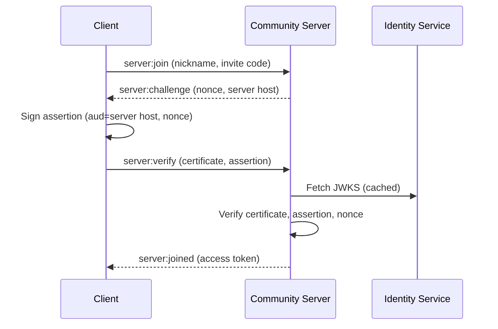

Gryt is designed so that **anyone can run a server** without being able to impersonate
the users who join it. This page explains the authentication model and the security
properties it provides.

## The problem with token forwarding

Most chat platforms that support third-party servers face a fundamental issue: when
you connect to a server, you need to prove who you are. The naive approach is to send
a bearer token (like a JWT from an identity provider) directly to the server.

The problem: a malicious server operator can capture that token and replay it to
impersonate you on other servers that accept the same token.

Gryt solves this with **challenge-response authentication** — you prove your identity
without ever sending a reusable credential to the server.

## How it works

Gryt uses three services for authentication:

- **Keycloak** (`auth.gryt.chat`) — the identity provider. You log in here once.
- **Identity Service** (`id.gryt.chat`) — signs certificates that bind your public key to your Gryt identity.
- **Community Servers** — run by anyone. They verify your identity cryptographically without receiving any reusable token.

### One-time setup

When you first sign in, the client:

1. Authenticates with Keycloak (OIDC + PKCE, same as before)
2. Generates an **ECDSA P-256 keypair** stored locally on your device
3. Sends the **public key** to the Identity Service (authenticated with your Keycloak token)
4. Receives a **signed certificate** — a JWT that says "Gryt confirms that public key X belongs to user Y"

The certificate is cached locally and renewed automatically (valid for 30 days).

### Joining a server

1. You request to join. The server responds with a **random nonce** and its hostname.
2. Your client signs an **assertion** — a short-lived JWT containing the server's hostname, the nonce, and your user ID — using your private key.
3. Your client sends the assertion along with your **identity certificate** (the one signed by the Identity Service).
4. The server verifies:
   - The certificate is signed by the Gryt Identity Service (via its public JWKS endpoint)
   - The assertion is signed by the public key in the certificate
   - The `aud` claim in the assertion matches the server's own hostname
   - The nonce matches and hasn't been used before

If everything checks out, the server issues a **server-scoped access token** (a short-lived JWT signed with the server's own secret). All subsequent API calls use this server token.

## What the server sees

| Data | Can the server see it? |
|------|----------------------|
| Your Gryt user ID | Yes — needed to identify returning users |
| Your public key | Yes — it's in the certificate |
| Your Keycloak token | **No** — never sent to community servers |
| Your private key | **No** — never leaves your device |
| Messages and uploads you send | Yes — that's how server-hosted chat works |

## What a malicious server cannot do

Even if a server operator captures everything sent during the join flow:

- **Cannot impersonate you on another server.** The assertion contains `aud: "evil-server.com"` — any other server rejects it because the audience doesn't match.
- **Cannot replay the assertion.** The nonce is single-use and expires in 60 seconds.
- **Cannot forge new assertions.** They don't have your private key.
- **Cannot use your certificate alone.** A certificate is not a bearer token — it only links a public key to an identity. Without the corresponding private key, it's useless.

## Token refresh

Once you've joined a server, token refresh uses only your **server-specific refresh token**
(a UUID stored in the server's database). No identity proof is needed for refresh — the
refresh token itself proves a valid prior session on that specific server and is useless
on any other server.

## Key management

Your ECDSA keypair is stored in IndexedDB (browser) or secure storage (Electron desktop app).
If you switch devices, a new keypair is generated and a new certificate is issued automatically
on first sign-in.

If you want to revoke a keypair (for example, if a device is compromised), sign in from
another device — the old certificate will expire naturally within 30 days, and the old
device's keypair becomes useless without a valid Keycloak session to obtain a new certificate.

## No server registration required

Servers do not need to be registered anywhere. Any server can verify certificates by
fetching the Identity Service's public JWKS — the same way any server already validates
Keycloak tokens today. This means you can run a server binary, point it at the JWKS URL,
and it works.

## Summary

| Property | How |
|----------|-----|
| Identity proof without token forwarding | Challenge-response with client-signed assertions |
| Server-bound proofs | Assertion `aud` claim matches the target server |
| Single-use proofs | Random nonce with 60-second TTL |
| No central server registry | Servers verify certificates via public JWKS |
| Key compromise recovery | Certificates expire; new keypairs generated per device |

## Further reading

- [Architecture](/docs/guide/architecture) — system overview and data flow
- [Why Gryt?](/docs/guide/why-gryt) — trust boundaries and philosophy
- [Configuration](/docs/guide/configuration) — server security settings
