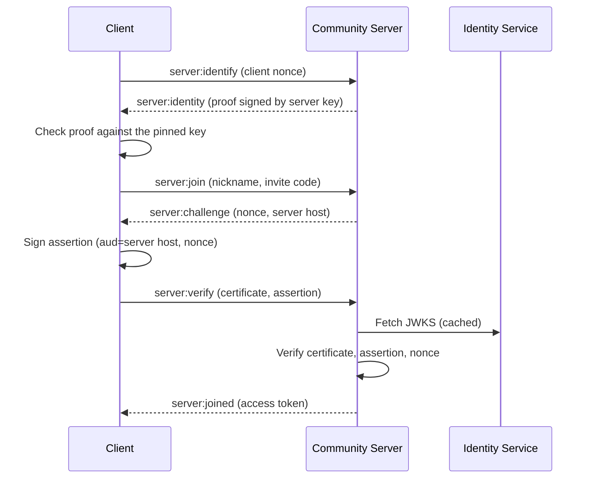

Gryt is designed so that **anyone can run a server** without being able to impersonate
the users who join it. This page explains the authentication model and the security
properties it provides.

## The problem with token forwarding

Most chat platforms that support third-party servers face a fundamental issue: when
you connect to a server, you need to prove who you are. The naive approach is to send
a bearer token (like a JWT from an identity provider) directly to the server.

The problem: a malicious server operator can capture that token and replay it to
impersonate you on other servers that accept the same token.

Gryt solves this with **challenge-response authentication** — you prove your identity
without ever sending a reusable credential to the server.

## How it works

Gryt uses three services for authentication:

- **Keycloak** (`auth.gryt.chat`) — the identity provider. You log in here once.
- **Identity Service** (`id.gryt.chat`) — signs certificates that bind your public key to your Gryt identity.
- **Community Servers** — run by anyone. They verify your identity cryptographically without receiving any reusable token.

### One-time setup

When you first sign in, the client:

1. Authenticates with Keycloak (OIDC + PKCE, same as before)
2. Generates an **ECDSA P-256 keypair** stored locally on your device
3. Sends the **public key** to the Identity Service (authenticated with your Keycloak token)
4. Receives a **signed certificate** — a JWT that says "Gryt confirms that public key X belongs to user Y"

The certificate is cached locally and renewed automatically (valid for 30 days).

### Joining a server


```mermaid
sequenceDiagram
    participant C as Client
    participant S as Community Server
    participant ID as Identity Service

    C->>S: server:identify (client nonce)
    S-->>C: server:identity (proof signed by server key)
    C->>C: Check proof against the pinned key
    C->>S: server:join (nickname, invite code)
    S-->>C: server:challenge (nonce, server host)
    C->>C: Sign assertion (aud=server host, nonce)
    C->>S: server:verify (certificate, assertion)
    S->>ID: Fetch JWKS (cached)
    S->>S: Verify certificate, assertion, nonce
    S-->>C: server:joined (access token)
```

The first two steps run on every connection, before anything else is sent — see
[Authenticating the server](#authenticating-the-server).

1. You request to join. The server responds with a **random nonce** and its hostname.
2. Your client signs an **assertion** — a short-lived JWT containing the server's hostname, the nonce, and your user ID — using your private key.
3. Your client sends the assertion along with your **identity certificate** (the one signed by the Identity Service).
4. The server verifies:
   - The certificate is signed by the Gryt Identity Service (via its public JWKS endpoint)
   - The assertion is signed by the public key in the certificate
   - The `aud` claim in the assertion matches the server's own hostname
   - The nonce matches and hasn't been used before

If everything checks out, the server issues a **server-scoped access token** (a short-lived JWT signed with the server's own secret). All subsequent API calls use this server token.

## What the server sees

| Data | Can the server see it? |
|------|----------------------|
| Your Gryt user ID | Yes — needed to identify returning users |
| Your public key | Yes — it's in the certificate |
| Your Keycloak token | **No** — never sent to community servers |
| Your private key | **No** — never leaves your device |
| Messages and uploads you send | Yes — that's how server-hosted chat works |

## What a malicious server cannot do

Even if a server operator captures everything sent during the join flow:

- **Cannot impersonate you on another server.** The assertion contains `aud: "evil-server.com"` — any other server rejects it because the audience doesn't match.
- **Cannot replay the assertion.** The nonce is single-use and expires in 60 seconds.
- **Cannot forge new assertions.** They don't have your private key.
- **Cannot use your certificate alone.** A certificate is not a bearer token — it only links a public key to an identity. Without the corresponding private key, it's useless.
- **Cannot pose as a server you already trust.** Servers are pinned by their identity key, so answering at a known address with a different key gets refused before anything is sent. See [Authenticating the server](#authenticating-the-server).

## Authenticating the server

Everything above proves *you* to the server. The other direction matters too: how does
your client know the server answering at an address is the one you joined before?

On `app.gryt.chat` TLS answers that — a certificate for the domain proves the endpoint.
On a LAN there is no TLS, no DNS authority, and mDNS advertisements are unauthenticated.
Anyone on the network can advertise a service with any name and any server ID, so a
server ID is a **discovery hint and never a credential**.

### Trust on first use

Each server generates a long-lived **ECDSA P-256 identity keypair** on first run and
stores the private half in its data directory as `server-identity-key.json`. This is
separate from the identity certificate authority, and separate from the server ID.

The first time you join a server, your client records its public key — the same
assumption SSH makes on a first connection. On every later connection, before your
client sends a token, a certificate or anything else:

1. The client sends a random nonce.
2. The server signs it with its identity key.
3. The client checks that signature against the key it pinned.

Because the pin is filed under the **key** rather than the address, a server that moves
to a new host or port is still recognised as the same server. That is what makes
automatic recovery safe when a server changes port — recognising it by server ID alone
would let anyone who read that ID over mDNS take its place.

### When a server's identity changes

If a different key answers at an address you have joined before, Gryt refuses the
connection and records it. Nothing is sent to that server. You will see
**"Server identity not recognised"**, and the server appears under
**Settings → You → Server identities**, showing the key that was expected and the one
that answered.

This is deliberately a refusal rather than a warning you can click through. A dismissable
warning trains people to dismiss it.

The common innocent cause is that you rebuilt or reinstalled the server and its data
directory was not preserved, so it generated a new identity. To confirm that is what
happened, check the server's startup log — it prints its identity key on boot:

```
✔ Server identity key ready (85lc28xWNMb-UkGlcc_kDowxgGHaeLKSYI0jVaKyTq4)
```

If that matches the fingerprint shown in settings, unblock it there. Unblocking retires
the old identity and pins the new one on the next connection.

<Callout type="warn">
  If you self-host, **back up `server-identity-key.json` along with your data**, and keep
  it when moving a server to a new machine. Lose it and every client that has joined will
  refuse to connect until each user unblocks the server by hand.
</Callout>

### What this does not cover

Pinning stops anyone **forging or impersonating** a server: without the private key they
cannot produce a valid proof. It does not stop someone **relaying** a genuine server's
proof in order to sit in the middle of an unencrypted LAN connection. They still cannot
authenticate as you — your assertion is bound to the address you dialled — but they can
read traffic that was already plaintext over `ws://`.

Encrypting LAN traffic is a separate, larger question. Over TLS (`wss://`), which is what
any internet-facing deployment should use, this does not apply.

### Rotating a server's key

A server can replace its identity key on purpose without every client treating it as an
attack:

```bash
yarn admin:rotate-identity --yes
```

This generates a new keypair and leaves a **succession statement** signed by the outgoing
key naming its replacement. The server offers that statement to clients alongside its
proof, and a client pinned to the old key follows the change automatically. Statements
last 180 days, so a client that was offline during the rotation still catches up, and a
client several rotations behind follows the chain forward.

<Callout type="warn">
  **This is for planned rotation, not for recovering from a compromised key.** The
  statement is signed by the key being retired, so anyone who already has that key can
  sign one too. If you believe a key has leaked, rotate it and then have users verify the
  new fingerprint out of band — the same caveat that applies to SSH's `known_hosts`.
</Callout>

## Token refresh

Once you've joined a server, token refresh uses only your **server-specific refresh token**
(a UUID stored in the server's database). No identity proof is needed for refresh — the
refresh token itself proves a valid prior session on that specific server and is useless
on any other server.

## Key management

Your ECDSA keypair is stored in IndexedDB (browser) or secure storage (Electron desktop app).
If you switch devices, a new keypair is generated and a new certificate is issued automatically
on first sign-in.

If you want to revoke a keypair (for example, if a device is compromised), sign in from
another device — the old certificate will expire naturally within 30 days, and the old
device's keypair becomes useless without a valid Keycloak session to obtain a new certificate.

## No server registration required

Servers do not need to be registered anywhere. Any server can verify certificates by
fetching the Identity Service's public JWKS — the same way any server already validates
Keycloak tokens today. This means you can run a server binary, point it at the JWKS URL,
and it works.

## Summary

| Property | How |
|----------|-----|
| Identity proof without token forwarding | Challenge-response with client-signed assertions |
| Server-bound proofs | Assertion `aud` claim matches the target server |
| Single-use proofs | Random nonce with 60-second TTL |
| No central server registry | Servers verify certificates via public JWKS |
| Key compromise recovery | Certificates expire; new keypairs generated per device |
| Server identity | Long-lived server keypair, pinned by the client on first join |
| Safe recovery when a server moves | Pins are filed under the key, not the address |

## Further reading

- [Architecture](/docs/guide/architecture) — system overview and data flow
- [Why Gryt?](/docs/guide/why-gryt) — trust boundaries and philosophy
- [Configuration](/docs/guide/configuration) — server security settings
- [AI policy](/docs/guide/ai) — which code is audited line by line, and how to verify it
