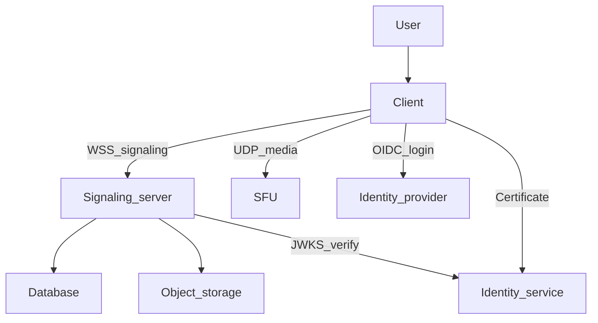

If you're evaluating Gryt and want a single page you can share, this is it.

Gryt is a self-hosted, open-source voice chat platform with text chat and file uploads. The goal is simple: make real-time communication that you can run yourself, understand, and verify.

## The short version

- **Self-host first**: run the server on your own infrastructure.
- **Open source**: the code is readable, auditable, and forkable.
- **Privacy is structural**: the architecture is designed to avoid unnecessary trust and data collection.
- **No paywalls**: features aren't gated behind subscriptions.
- **Identity stays with you**: no server can steal or impersonate your identity.

## Minimal identity, not a social graph

Gryt intentionally separates **identity** from **server data**:

- **Identity** is used to prove "this is the same user as last time."
- **Server data** is everything that belongs to a server: channels, roles, membership, messages, and uploads.

When you join a server, you prove your identity through a [challenge-response protocol](/docs/guide/security) — the server never receives a reusable token it could replay. The server you join can still store and process the content you send to it (messages and uploads), because that's how server-hosted communication works.

## Trust boundaries (what you're trusting)

Here's the honest version of the trust model:

- **If you join someone else's server**, you are trusting that server operator with the data their server stores. You are **not** trusting them with your identity — they can't impersonate you.
- **If you self-host**, that operator is you.
- **Voice uses WebRTC encryption in transit (DTLS-SRTP)**, but media is routed through infrastructure operated by the server owner (the SFU).
- **By default, login uses the hosted identity provider** at `auth.gryt.chat`. It issues certificates that servers can verify cryptographically (JWKS). Your Keycloak token never reaches a community server.

If you use the hosted web client at `app.gryt.chat`, also see the [Privacy Policy](https://gryt.chat/privacy) on the site.

## Architecture (simple)

Most of Gryt fits into four boxes:

- **Client**: UI + audio processing + WebRTC
- **Server**: chat, rooms, permissions, uploads, coordination
- **SFU**: routes voice media to everyone in a channel
- **Storage**: database + object storage

If you want the deeper technical diagrams and data flow, see the full [Architecture](/docs/guide/architecture) page.

## Skeptic FAQ

### Can a malicious server steal my login?

No. Gryt uses [challenge-response authentication](/docs/guide/security). Your Keycloak token is never sent to a community server. You prove your identity by signing a one-time challenge with a private key that stays on your device. The signed proof is bound to that specific server and expires in 60 seconds — it's useless anywhere else.

### Can a server admin read my messages?

If the server stores messages, the server operator can access them. This is the same trade-off as any self-hosted chat system. Gryt's point is that you can run the server yourself, or choose a server operator you trust.

### Can the SFU listen to voice?

WebRTC encrypts voice in transit, but the SFU is part of the communication path and terminates WebRTC sessions to forward media. Practically: if you don't control the SFU, treat it as trusted infrastructure.

### What does self-hosting actually buy me?

If you run your own Gryt server, your community's server data (messages, uploads, membership, roles) is stored on infrastructure you control. That narrows the trust surface compared to a centralized platform where all data lives under a single provider.

### Do I need to register my server anywhere?

No. Servers verify identity certificates by fetching a public key from the Identity Service's JWKS endpoint. There is no central directory, no approval process, no "nobody knows my server exists" problem.

## Further reading

- [Security](/docs/guide/security)
- [Architecture](/docs/guide/architecture)
- [Quick Start](/docs/guide/quick-start)
- [Docker Compose deployment](/docs/deployment/docker-compose)
- [Configuration](/docs/guide/configuration)
- [Licensing](/docs/guide/licensing)
