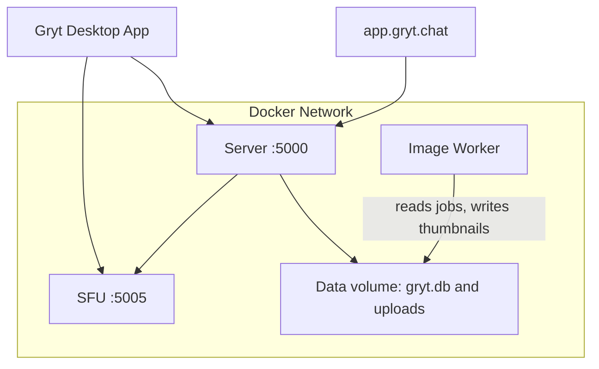

import { Callout } from 'fumadocs-ui/components/callout';
import { Step, Steps } from 'fumadocs-ui/components/steps';
import { Tab, Tabs } from 'fumadocs-ui/components/tabs';

The fastest way to self-host Gryt. Everything runs from pre-built images published to
GitHub Container Registry — no need to clone any repos or build anything.

## What's included

| Service | Image | Purpose | Required? |
|---------|-------|---------|-----------|
| **Server** | `ghcr.io/gryt-chat/server` | Signaling, chat, file uploads | Yes |
| **SFU** | `ghcr.io/gryt-chat/sfu` | WebRTC media forwarding | Yes |
| **Image Worker** | `ghcr.io/gryt-chat/image-worker` | Background image compression + thumbnailing | Optional (recommended) |
| **Client** | `ghcr.io/gryt-chat/client` | Web UI (React + Nginx) | Dev / local only |
| **Prometheus** | `prom/prometheus` | Metrics collection | Optional |
| **Grafana** | `grafana/grafana` | Metrics dashboards | Optional |

Uploads are plain files in the server's data volume, next to its database, so
there's no storage service to run or set up.

Most users connect via the [Gryt desktop app](https://github.com/Gryt-chat/gryt/releases) (available for Linux, macOS, and Windows).

<Callout type="warn" title="Web client and authentication">
The web client Docker image is included for **local development and contributing** to Gryt. It is **not recommended for production self-hosting** because the OIDC login flow requires your domain to be registered as a redirect URI with the centralized auth service at `auth.gryt.chat` — and only official Gryt domains are whitelisted.

If you need a web-based interface, use the hosted client at [app.gryt.chat](https://app.gryt.chat), or connect with the desktop app.

You _can_ self-host your own Keycloak, but that means your users will have separate accounts that don't work on other Gryt servers (no cross-server identity).
</Callout>

## Quick start

<Steps>

<Step>
### Download the compose file and example env

<Tabs items={["curl", "wget"]}>
<Tab value="curl">
```bash
mkdir gryt && cd gryt
curl -Lo docker-compose.yml https://raw.githubusercontent.com/Gryt-chat/gryt/main/ops/deploy/compose/prod.yml
curl -Lo .env https://raw.githubusercontent.com/Gryt-chat/gryt/main/ops/deploy/compose/.env.example
```
</Tab>
<Tab value="wget">
```bash
mkdir gryt && cd gryt
wget -O docker-compose.yml https://raw.githubusercontent.com/Gryt-chat/gryt/main/ops/deploy/compose/prod.yml
wget -O .env https://raw.githubusercontent.com/Gryt-chat/gryt/main/ops/deploy/compose/.env.example
```
</Tab>
</Tabs>

</Step>

<Step>
### Edit the `.env` file

Open `.env` in your editor and configure at minimum:

```bash
# Give your server a name
SERVER_NAME=My Gryt Server

# Set a real secret in production
JWT_SECRET=<run: openssl rand -base64 48>

# Allowed origins (desktop app + hosted web client)
CORS_ORIGIN=http://127.0.0.1:15738,https://app.gryt.chat
```

</Step>

<Step>
### Start the server

```bash
docker compose up -d
```

This starts the **Server**, the **SFU** and the **Image Worker**.
Connect with the [Gryt desktop app](https://github.com/Gryt-chat/gryt/releases) or
the hosted web client at [app.gryt.chat](https://app.gryt.chat).

**Invite-only**: the **first user** to join a brand-new server becomes the **owner/admin** automatically.
After that, the server is **invite-only**. Create invite links in **Server settings → Invites** and share them.

</Step>

</Steps>

## Architecture



## Configuration reference

### Image versions

Images default to `latest`. Pin a specific version for reproducible deploys:

```bash
SERVER_VERSION=x.y.z
SFU_VERSION=x.y.z
IMAGE_WORKER_VERSION=x.y.z  # only if running image-worker
```

Browse available tags at [github.com/orgs/gryt-chat/packages](https://github.com/orgs/gryt-chat/packages).

### Beta channel

The Gryt server, SFU, image worker, and web client publish a `latest-beta`
image. To follow the beta channel, set the version variables in `.env`:

```bash
SERVER_VERSION=latest-beta
SFU_VERSION=latest-beta
IMAGE_WORKER_VERSION=latest-beta

# Only used when the optional web profile is enabled
CLIENT_VERSION=latest-beta
```

Then pull and restart the stack:

```bash
docker compose pull
docker compose up -d
```

`latest-beta` moves whenever a new beta is published. For a predictable
deployment, replace it with the exact tag shown in the package registry, such
as `1.2.3-beta.4`. Pin each service separately because its version may differ
from the others.

<Callout type="warn" title="Back up before trying a beta">
Beta builds may change the SQLite schema when the server starts. Gryt has no
down-migration system, so an older server can't undo those changes. Back up the
server data directory before upgrading. To return to stable, restore that
backup, change the version variables to `latest` or exact stable tags, then run
`docker compose pull` and `docker compose up -d` again.
</Callout>

A beta server doesn't change any other server a user belongs to. The risk is
at the client-server boundary: a stable client may not understand a beta-only
event or endpoint, and a beta client may expect something a stable server does
not provide. Run the matching beta desktop client when testing a beta server.

People joining can't rely on the client to identify a self-hosted server's
release channel. Add `Beta` to `SERVER_NAME` and mention the version in
`SERVER_DESCRIPTION` so they know what they're joining:

```bash
SERVER_NAME=My Gryt Server (Beta)
SERVER_DESCRIPTION=Testing Gryt 1.2.3-beta.4
```

### Image Worker

| Variable | Default | Description |
|----------|---------|-------------|
| `IMAGE_WORKER_CONCURRENCY` | `2` | Max images processed in parallel |
| `IMAGE_WORKER_POLL_MS` | `1000` | Poll interval for queued jobs (ms) |

### Ports

| Variable | Default | Description |
|----------|---------|-------------|
| `SERVER_PORT` | `5000` | Signaling API + WebSocket |
| `SFU_PORT` | `5005` | SFU WebSocket |
| `ICE_UDP_MUX_PORT` | `3478` | The one UDP port all WebRTC media flows over |

### Server

| Variable | Default | Description |
|----------|---------|-------------|
| `SERVER_NAME` | `My Gryt Server` | Display name in the server browser |
| `SERVER_DESCRIPTION` | `A Gryt voice chat server` | Server description |
| `SERVER_PASSWORD` | *(empty)* | Optional server↔SFU shared secret (**not** a user join password) |
| `SERVER_INVITE_MAX_RETRIES` | `8` | Invalid invite attempts before lockout (per IP+user) |
| `SERVER_INVITE_RETRY_WINDOW_MS` | `300000` | Sliding window for attempt counting (5 min) |
| `SERVER_INVITE_RETRY_COOLDOWN_MS` | `60000` | Base cooldown after lockout (1 min) |
| `SERVER_INVITE_MAX_COOLDOWN_MS` | `3600000` | Cooldown escalation cap (1 hour) |
| `SERVER_INVITE_IP_MAX_RETRIES` | `20` | Per-IP invalid invite attempts before lockout |
| `VOICE_MAX_USERS` | *(auto)* | Optional voice seat limit override |
| `REFRESH_TOKEN_TTL_DAYS` | `7` | Refresh token lifetime (days) |
| `JWT_SECRET` | `change-me-in-production` | Session token secret |
| `CORS_ORIGIN` | see below | Allowed origins (comma-separated). Always include `http://127.0.0.1:15738` (desktop app). Include `https://app.gryt.chat` if you want users to connect via the hosted web client. |

If you set `SERVER_PASSWORD`, keep it stable. Changing it may require restarting the SFU, because the SFU caches the password per server ID.

### Changing the server owner (CLI)

The **first user** to join a brand-new server becomes the **owner/admin** automatically.

To change the owner later, run:

```bash
docker compose exec server node admin-setOwner.js --grytUserId <keycloak_sub>
```

`<keycloak_sub>` is your Gryt user ID. You can find it in the desktop app or web client by going to **Settings → Profile** and scrolling to the bottom.

### Authentication

| Variable | Default | Description |
|----------|---------|-------------|
| `GRYT_IDENTITY_TIERS` | `account` | Comma-separated identity types the server accepts. Add `local` to admit people without a Gryt account. |
| `GRYT_SERVER_ENABLED` | `true` | Whether the server accepts joins. `false` rejects every join while it's out of service. Any other value also rejects joins and reports itself as misconfigured. The old name `GRYT_AUTH_MODE`, with `required` and `disabled`, still works; the new name wins when both are set. |
| `GRYT_OIDC_ISSUER` | `https://auth.gryt.chat/realms/gryt` | OIDC issuer URL |
| `GRYT_OIDC_AUDIENCE` | `gryt-web` | OIDC audience |

### WebRTC / NAT

| Variable | Default | Description |
|----------|---------|-------------|
| `STUN_SERVERS` | Google STUN | Comma-separated STUN URIs |
| `SFU_PUBLIC_HOST` | `ws://localhost:5005` | Public SFU URL(s) for browsers (comma-separated for multi-network) |
| `ICE_ADVERTISE_IP` | *(auto)* | Public IP(s) to advertise in ICE candidates (comma-separated for multi-network) |

### Uploads

There's nothing to set. The server keeps uploads in `/data/gryt`, in the
`gryt-prod_gryt-prod-server-data` volume that also holds `gryt.db`. The image
worker mounts the same volume to make thumbnails. Back up that one volume and
you have everything. [Backups](/docs/host/backups) has the commands.

## Production checklist

<Callout type="warn" title="Before going public">
- [ ] Set a strong `JWT_SECRET` — generate with `openssl rand -base64 48`
- [ ] Open `ICE_UDP_MUX_PORT` as **UDP** for the SFU
- [ ] Set `ICE_ADVERTISE_IP` if behind NAT
- [ ] Set `SFU_PUBLIC_HOST` to your public `wss://` URL
- [ ] Ensure `CORS_ORIGIN` includes `http://127.0.0.1:15738` (desktop app) and `https://app.gryt.chat` (hosted web client)
- [ ] Put a reverse proxy (Caddy, Nginx, Traefik) in front for TLS
- [ ] Pin image versions instead of `latest`
</Callout>

### TLS with Caddy (recommended)

The simplest way to add HTTPS is [Caddy](https://caddyserver.com/) — it handles certificates automatically.

Add this to your `docker-compose.yml`:

```yaml
services:
  caddy:
    image: caddy:latest
    container_name: gryt-caddy
    ports:
      - "80:80"
      - "443:443"
    volumes:
      - ./Caddyfile:/etc/caddy/Caddyfile:ro
      - caddy-data:/data
    networks:
      - gryt
    restart: unless-stopped

volumes:
  caddy-data:
```

And create a `Caddyfile`:

```
api.example.com {
    reverse_proxy server:5000
}

sfu.example.com {
    reverse_proxy sfu:5005
}
```

Then update your `.env`:

```bash
CORS_ORIGIN=http://127.0.0.1:15738,https://app.gryt.chat
SFU_PUBLIC_HOST=wss://sfu.example.com

# Multi-network example (LAN party + public):
# SFU_PUBLIC_HOST=wss://sfu.example.com,ws://192.168.1.100:5005
# ICE_ADVERTISE_IP=203.0.113.10,192.168.1.100
```

## LAN optimization

<Callout type="info" title="Hosting for a LAN party or local network?">
Add your server's LAN IP to `ICE_ADVERTISE_IP` and `SFU_PUBLIC_HOST` so clients on the same
network connect directly — skipping external STUN entirely for near-zero-latency voice.
</Callout>

```bash
# Your server's LAN IP (find it with: hostname -I | awk '{print $1}')
ICE_ADVERTISE_IP=192.168.1.100
SFU_PUBLIC_HOST=ws://192.168.1.100:5005
```

For mixed setups where some users are on the LAN and others connect over the internet, use
comma-separated values. The client automatically pings each SFU endpoint and picks the fastest:

```bash
ICE_ADVERTISE_IP=203.0.113.10,192.168.1.100
SFU_PUBLIC_HOST=wss://sfu.example.com,ws://192.168.1.100:5005
```

## Managing the stack

```bash
# View logs
docker compose logs -f

# View logs for a single service
docker compose logs -f server

# Restart a service after config change
docker compose restart server

# Update to latest images
docker compose pull && docker compose up -d

# Update a single service to a specific version
SFU_VERSION=x.y.z docker compose up -d sfu

# Stop everything
docker compose down

# Stop and remove all data (clean slate)
docker compose down -v
```

## Keeping your server up to date

```bash
curl -fsSL https://raw.githubusercontent.com/Gryt-chat/gryt/main/ops/deploy/auto-update/install.sh | sudo bash
```

Installs a systemd timer that checks GHCR once a night. It pulls whatever
image your compose file already names for your channel — `latest` or
`latest-beta`, whichever `docker-compose.yml` points at — and recreates
only the containers whose image actually changed. It won't bring up a service
you haven't started, and it won't touch anything outside `docker-compose.yml`.

Calls in progress aren't cut. Recreating the SFU would drop them, so it waits
until nobody is in voice — checked every night, applied the first time the
channel empties. If it can't read the peer count, it defers too, rather than
guess.

See the log with:

```bash
journalctl -u gryt-auto-update -n 50
```

Turn it off with:

```bash
curl -fsSL https://raw.githubusercontent.com/Gryt-chat/gryt/main/ops/deploy/auto-update/install.sh | sudo bash -s -- --uninstall
```

Prefer to update by hand? Skip the installer and stick with `docker compose
pull && docker compose up -d` from [Managing the stack](#managing-the-stack)
below.

<Callout type="info" title="Already running the hand-rolled version?">
If somebody set this up for you before this page existed, you're running the
same script under the old names (`gryt-web-client-refresh`). The installer
above picks up its settings automatically — same environment variables — and
tells you how to retire the old timer once you've checked the new one works.
</Callout>

## Health checks

All services expose health endpoints. Check the stack health:

```bash
curl http://localhost:5000/health   # server
curl http://localhost:5005/health   # sfu
```

The image worker's health endpoint (`GET /` on port 8080) is internal-only — it's used by Docker's built-in healthcheck and isn't exposed to the host.

Or use `docker compose ps` to see the health status of all containers.

## Monitoring

Both the Server and SFU expose Prometheus metrics at `/metrics`. Enable the
optional monitoring stack (Prometheus + Grafana) with:

```bash
docker compose --profile monitoring up -d
```

Grafana is available at [http://localhost:3000](http://localhost:3000) (default login: `admin` / `admin`).

See the full [Monitoring guide](/docs/host/monitoring) for configuration, available metrics, and recommended dashboards.

## Upgrading

```bash
# Pull the latest images
docker compose pull

# Recreate containers with new images
docker compose up -d

# Verify
docker compose ps
```

To upgrade to specific versions, edit the `*_VERSION` vars in `.env`:

```bash
SERVER_VERSION=x.y.z
SFU_VERSION=x.y.z
```

Then run `docker compose up -d`.

## Running more than one server

One compose file can run as many Gryt servers as you like. They're fully separate — their own channels,
members, invites and roles — and they share the expensive parts of the stack.

What each extra server needs:

| Needs its own | Why |
|---|---|
| `DATA_DIR` volume | The SQLite database and the uploads. This is the one that matters — two servers pointed at one `gryt.db` will corrupt each other's state. |
| `SERVER_NAME` | It's part of the server's identity on the SFU. See the warning below. |
| Published port | One port per server on the host. |
| Image worker | A worker reads exactly one `DATA_DIR`, so it serves exactly one server. |

They share one SFU. Voice rooms are namespaced per server, so a single SFU serves all of them. This is how
gryt.chat itself runs — three servers, one SFU. Uploads aren't shared, because each server keeps its own in
its data volume.

<Callout type="warn">
**Give every server a different `SERVER_NAME`.** A server identifies itself to the SFU as
`SERVER_NAME_PORT_SERVER_INSTANCE_ID`, and voice rooms are keyed on that. Two servers that produce the same
string will fight over room registration and the second one's voice will fail to start. On a bridge network
every container has the same internal `PORT`, so the name is usually the only thing telling them apart — or
set `SERVER_INSTANCE_ID` explicitly, which is what the bundled dev stack does.
</Callout>

### Adding a second server

Copy the `server` and `image-worker` blocks, and change four things — the container names, the port, the
data volume, and the name:

```yaml
services:
  server-2:
    image: ghcr.io/gryt-chat/server:${SERVER_VERSION:-latest}
    container_name: gryt-prod-server-2
    network_mode: host
    extra_hosts:
      - "sfu:127.0.0.1"
    environment:
      PORT: 5010                      # a free port on the host
      SERVER_NAME: My Second Server   # must differ from the first
      DATA_DIR: /data                 # its own volume, mounted below
      STORAGE_BACKEND: filesystem     # uploads go in /data/gryt
      S3_BUCKET: gryt
      JWT_SECRET: ${JWT_SECRET_2:?Set JWT_SECRET_2 in .env}
      SFU_WS_HOST: ws://sfu:${SFU_PORT:-5005}   # the same SFU
      IMAGE_WORKER_URL: http://127.0.0.1:8082
      # …every other variable copied from the first server
    volumes:
      - gryt-prod-server-2-data:/data

  image-worker-2:
    image: ghcr.io/gryt-chat/image-worker:${IMAGE_WORKER_VERSION:-latest}
    container_name: gryt-prod-image-worker-2
    ports:
      - "127.0.0.1:8082:8080"         # a different health port
    environment:
      DATA_DIR: /data
      STORAGE_BACKEND: filesystem
      S3_BUCKET: gryt
    volumes:
      - gryt-prod-server-2-data:/data # the same volume as its own server

volumes:
  gryt-prod-server-2-data:
```

`ops/deploy/compose/prod.yml` ships this as a commented-out block, so uncommenting it's usually faster than
writing it out.

<Callout type="info">
The image worker isn't on the critical path. Uploads succeed whether or not a worker is running — what you
lose without one is thumbnails, recompression and the dominant colour used to tint voice tiles. If you don't
care about those on a second server, you can leave its worker out entirely.
</Callout>

<Callout type="warn">
The bundled `server` uses `network_mode: host` so it can advertise itself on the LAN through avahi, and the
avahi service file has a fixed name. Two host-networked servers on one machine will overwrite each other's
file, and only one of them will be discoverable on the LAN. Both still work normally by address. If LAN
discovery matters for both, put them on separate machines or move them to the bridge network and drop the
`/etc/avahi/services` mount.
</Callout>

## Moving off MinIO

Older copies of this compose file ran MinIO for uploads. The new one moves them
out by itself the first time it starts, so upgrading is the usual pull and up.

<Steps>

<Step>
### Back up both volumes

With the stack stopped, so nothing changes under the copy:

```bash
docker compose down
for v in gryt-prod_gryt-prod-server-data gryt-prod_gryt-prod-minio-data; do
  docker run --rm -v "$v:/v:ro" -v "$PWD:/out" alpine tar czf "/out/$v-$(date +%F).tar.gz" -C /v .
done
```

`down` without `-v`. With `-v` it deletes the volumes you're about to copy.

</Step>

<Step>
### Download the new compose file and start it

In the same folder as your `.env`:

```bash
curl -Lo docker-compose.yml https://raw.githubusercontent.com/Gryt-chat/gryt/main/ops/deploy/compose/prod.yml
docker compose up -d --remove-orphans
```

If you changed anything in your old `docker-compose.yml`, carry it over before
the `up`. `--remove-orphans` takes away the old MinIO containers. Their volume
stays.

</Step>

<Step>
### Check it worked

```bash
docker compose logs storage-migrate
```

The last line says how it went:

```
storage-migrate: Done in 8s: 205 objects and 153 MB copied, every SHA-256 matches.
```

Open an old message with a picture in it, and check the server icon still
shows.

</Step>

<Step>
### Tidy up, when you're happy

The MinIO volume is still there, untouched. Delete it once a backup has run
from the new setup:

```bash
docker volume rm gryt-prod_gryt-prod-minio-data
```

The `MINIO_*` and `S3_*` lines in `.env` can go too.

</Step>

</Steps>

### What `storage-migrate` does

It's a one-shot container that runs before the server and the image worker
every time the stack starts. They wait for it, and they don't start if it
fails. It checks these in order:

1. `/data/gryt` has a `.migrated-from-minio` file. It's done already, so it
   exits. That's every start after the first.
2. The old MinIO volume is empty, which it is on a new install. It writes the
   marker and exits.
3. `/data/gryt` already has files but no marker. It stops rather than guess
   which copy is right, and the server stays down. See below.
4. Otherwise it starts the old MinIO read-only and copies your bucket into
   `/data/gryt`. It reads every file back and compares its SHA-256 with the
   original, then writes the marker. If anything doesn't match, it stops
   without the marker, and the server stays down.

It never changes or deletes anything in the MinIO volume. It logs in with
`MINIO_ROOT_USER` and `MINIO_ROOT_PASSWORD` from your `.env`, and uses MinIO's
default if they aren't there. It copies the bucket named by `S3_BUCKET`, which
defaults to `gryt`, or `gryt-beta` in `beta.yml`. The copy takes about the same
room again on disk, and it checks there's enough before it starts.

A 150 MB bucket took about 8 seconds on an SSD. A Raspberry Pi on a USB disk
will be slower.

### If it stops

The log says why. The usual reason is files left in `/data/gryt` by a run that
failed partway. Delete that folder and start the stack again:

```bash
docker run --rm -v gryt-prod_gryt-prod-server-data:/data alpine rm -rf /data/gryt
docker compose up -d
```

If you copied the uploads over yourself and want to keep that copy, create the
marker instead, and it'll leave them alone:

```bash
docker run --rm -v gryt-prod_gryt-prod-server-data:/data alpine touch /data/gryt/.migrated-from-minio
```

The volume names above are the ones `prod.yml` makes. For `beta.yml` they're
`gryt-beta_gryt-beta-server-data` and `gryt-beta_gryt-beta-minio-data`.
`docker volume ls` shows yours.

A second server that shared the first one's MinIO bucket needs a copy of its
own. `prod.yml` has a commented `storage-migrate-2` beside the commented
`server-2`. Uncomment it along with the server.
