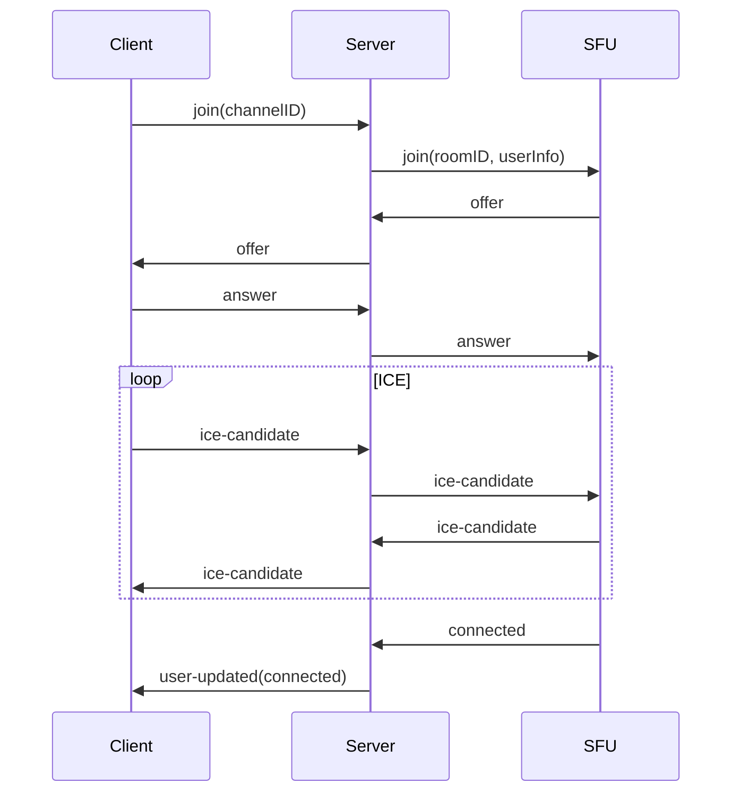

The Gryt signaling server is a Node.js/TypeScript application that manages WebRTC signaling, user sessions, room coordination, and authentication. It acts as the central hub between clients and the SFU.

## Features

- **WebRTC signaling**: Offer/answer exchange, ICE candidate relay, renegotiation
- **Room management**: Multi-room support with server-prefixed IDs, auto-cleanup
- **User state**: Nickname, mute, presence tracking with real-time sync
- **Chat**: Text channels with message editing, replies, attachments, nonce-based deduplication, and owner moderation
- **WebSocket**: Socket.IO with automatic reconnection and rate limiting
- **Auth**: JWT validation via Keycloak JWKS (hosted at `auth.gryt.chat`)
- **Metrics**: Prometheus endpoint (`/metrics`) with HTTP, Socket.IO, and Node.js runtime metrics

## Getting started

```bash
cd packages/server
yarn install
cp .env.example .env
yarn dev
```

## Environment variables

```bash
PORT=5000
SFU_WS_HOST="ws://sfu:5005"
# Comma-separated for multi-network (client auto-selects fastest)
SFU_PUBLIC_HOST="wss://sfu.example.com"
STUN_SERVERS="stun:stun.l.google.com:19302"

SERVER_NAME="My Brand New Server"
CORS_ORIGIN="http://127.0.0.1:15738,https://app.gryt.chat"

# Optional: server-to-SFU shared secret (NOT a user join password)
# SERVER_PASSWORD="your-internal-sfu-shared-secret"

# Invite brute-force protection (optional)
# SERVER_INVITE_MAX_RETRIES=8
# SERVER_INVITE_RETRY_WINDOW_MS=300000
# SERVER_INVITE_RETRY_COOLDOWN_MS=60000
# SERVER_INVITE_MAX_COOLDOWN_MS=3600000
# SERVER_INVITE_IP_MAX_RETRIES=20

GRYT_AUTH_API=https://auth.gryt.chat

# SQLite
DATA_DIR=./data

# S3 / Object storage
S3_REGION=auto
S3_ACCESS_KEY_ID=
S3_SECRET_ACCESS_KEY=
S3_BUCKET=gryt-bucket
S3_FORCE_PATH_STYLE=false

NODE_ENV=development
DEBUG=gryt:*
```

## Authentication

Gryt uses a centrally hosted **Keycloak** instance so users have a single "Gryt account" across all servers.

- **Clients** authenticate via OIDC Authorization Code + PKCE (public client `gryt-web`)
- **Servers** validate JWTs by checking the signature against the Keycloak JWKS endpoint

### Required env vars

```bash
GRYT_AUTH_MODE=required                            # default
GRYT_OIDC_ISSUER=https://auth.gryt.chat/realms/gryt
GRYT_OIDC_AUDIENCE=gryt-web
```

Set `GRYT_AUTH_MODE=disabled` to reject all joins (server lock).

## Changing the owner (CLI)

The **first user** to join a brand-new server automatically becomes the **owner/admin**.

To change the owner later (recovery/transfers), run:

```bash
node dist/admin/setOwner.js --grytUserId <keycloak_sub>
```

When running in Docker Compose:

```bash
docker compose exec server node dist/admin/setOwner.js --grytUserId <keycloak_sub>
```

### Local Keycloak (dev)

```bash
docker compose -f packages/auth/docker-compose.keycloak.yml up
```

Point client/server configs to `http://localhost:8080/realms/gryt`.

## WebSocket events

### Client → Server (high-level)

| Event | Payload | Notes |
|------|---------|------|
| `server:join` | `{ nickname?, identityToken, inviteCode? }` | Join the server. **Invite-only** unless you are already a member or you are the first user (bootstrap owner). |
| `server:leave` | `{}` | Leave (deactivate membership) and revoke refresh tokens for that user. |
| `server:details` | `{}` | Get server details (requires joined session). |
| `server:info` | `{}` | Public server preview (no join required). |
| `token:refresh` | `{ refreshToken?, identityToken?, accessToken? }` | Refresh an access token (preferred: refreshToken + identityToken). |
| `voice:room:request` | `roomId: string` | Request a voice join token + SFU URL(s). |
| `voice:stream:set` | `streamID: string` | Mark user as joined/left voice; enables device-switch handling. |
| `voice:state:update` | `{ isMuted, isDeafened, isAFK }` | Update voice presence flags. |
| `chat:send` | `{ conversationId, accessToken, text?, attachments?, replyToMessageId?, nonce? }` | Send message (nonce supports idempotent retry). |
| `chat:fetch` | `{ conversationId, accessToken?, limit?, before? }` | Fetch message history. |

### Server → Client (high-level)

| Event | Payload | Notes |
|------|---------|------|
| `server:joined` | `{ accessToken, refreshToken?, nickname, avatarFileId?, isOwner, setupRequired }` | Join success. |
| `server:error` | `{ error, message?, retryAfterMs?, canReapply? }` | Includes `invite_required`, `invalid_invite`, rate limits, etc. |
| `server:details` | `serverDetails` | Full server state for the UI. |
| `server:info` | `{ name, description?, members?, version? }` | Public preview. |
| `token:refreshed` | `{ accessToken }` | New access token. |
| `token:error` / `token:revoked` | `{ error, message? }` | Token invalid/revoked. |
| `voice:room:granted` | `{ room_id, join_token, sfu_url, sfu_urls?, timestamp }` | SFU join credentials. |
| `voice:room:error` | `string \| { error, message?, retryAfterMs? }` | Voice join errors (rate-limited, full, unavailable). |

## REST endpoints

### Messages
- `GET /api/messages/:conversationId?limit=50&before=<ISO>` — returns `{ items: Message[] }`
- `POST /api/messages/:conversationId` — body `{ senderId, text?, attachments? }`

### Uploads
- `POST /api/uploads` (multipart) — stores file in S3, generates thumbnail if image, returns `{ fileId, key, thumbnailKey }`

## Signaling flow



## Debug endpoints (development)

| Endpoint | Description |
|----------|-------------|
| `GET /health` | Health check |
| `GET /metrics` | Prometheus metrics |
| `GET /debug/rooms` | Room states |
| `GET /debug/users` | Connected users |
| `GET /debug/connections` | WebSocket connections |
