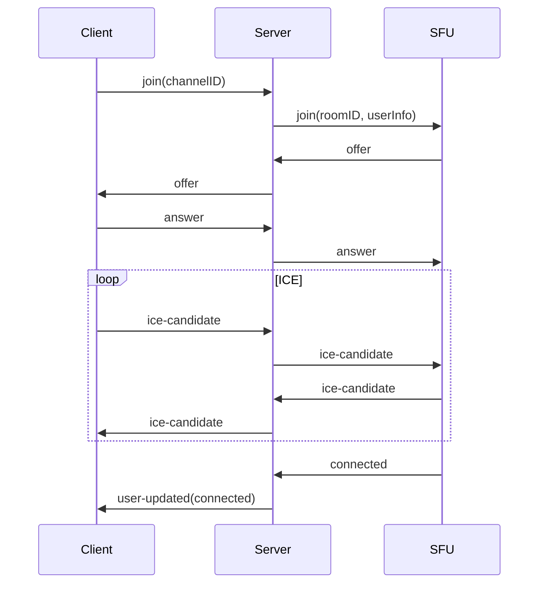

The Gryt signaling server is a Node.js/TypeScript application that manages WebRTC signaling, user sessions, room coordination, and authentication. It acts as the central hub between clients and the SFU.

## Features

- **WebRTC signaling**: Offer/answer exchange, ICE candidate relay, renegotiation
- **Room management**: Multi-room support with server-prefixed IDs, auto-cleanup
- **User state**: Nickname, mute, presence tracking with real-time sync
- **Chat**: Text channels with message editing, replies, attachments, nonce-based deduplication, and owner moderation
- **WebSocket**: Socket.IO with automatic reconnection and rate limiting
- **Auth**: JWT validation via Keycloak JWKS (hosted at `auth.gryt.chat`)

## Getting started

```bash
cd packages/server
bun install
cp .env.example .env
bun dev
```

## Environment variables

```bash
PORT=5000
SFU_WS_HOST="ws://sfu:5005"
# Comma-separated for multi-network (client auto-selects fastest)
SFU_PUBLIC_HOST="wss://sfu.example.com"
STUN_SERVERS="stun:stun.l.google.com:19302"

SERVER_NAME="My Brand New Server"
SERVER_INVITE_ONLY="false"
CORS_ORIGIN="https://gryt.chat"
SERVER_PASSWORD="123"

# Password brute-force protection (optional)
# SERVER_PASSWORD_MAX_RETRIES=5
# SERVER_PASSWORD_RETRY_WINDOW_MS=300000
# SERVER_PASSWORD_RETRY_COOLDOWN_MS=60000
# SERVER_PASSWORD_MAX_COOLDOWN_MS=3600000
# SERVER_PASSWORD_IP_MAX_RETRIES=15

GRYT_AUTH_API=https://auth.gryt.chat

# ScyllaDB
SCYLLA_CONTACT_POINTS=127.0.0.1
SCYLLA_LOCAL_DATACENTER=datacenter1
SCYLLA_KEYSPACE=gryt

# S3 / Object storage
S3_REGION=auto
S3_ACCESS_KEY_ID=
S3_SECRET_ACCESS_KEY=
S3_BUCKET=gryt-bucket
S3_FORCE_PATH_STYLE=false

SERVER_VERSION="1.0.0"

NODE_ENV=development
DEBUG=gryt:*
```

## Authentication

Gryt uses a centrally hosted **Keycloak** instance so users have a single "Gryt account" across all servers.

- **Clients** authenticate via OIDC Authorization Code + PKCE (public client `gryt-web`)
- **Servers** validate JWTs by checking the signature against the Keycloak JWKS endpoint

### Required env vars

```bash
GRYT_AUTH_MODE=required                            # default
GRYT_OIDC_ISSUER=https://auth.gryt.chat/realms/gryt
GRYT_OIDC_AUDIENCE=gryt-web
```

Set `GRYT_AUTH_MODE=disabled` to skip auth entirely.

### Local Keycloak (dev)

```bash
docker compose -f packages/auth/docker-compose.keycloak.yml up
```

Point client/server configs to `http://localhost:8080/realms/gryt`.

## WebSocket events

### Client to Server

| Event | Payload | Description |
|-------|---------|-------------|
| `join` | `{ channelID }` | Join a voice channel |
| `leave` | `{}` | Leave current channel |
| `updateNickname` | `string` | Update nickname |
| `updateMute` | `boolean` | Update mute state |
| `offer` | `RTCSessionDescription` | WebRTC offer for SFU |
| `answer` | `RTCSessionDescription` | WebRTC answer from SFU |
| `ice-candidate` | `RTCIceCandidate` | ICE candidate |
| `chat:send` | `{ conversationId, accessToken, text?, attachments?, replyToMessageId?, nonce? }` | Send a chat message (nonce enables idempotent retry) |
| `chat:edit` | `{ conversationId, accessToken, messageId, text }` | Edit own message |
| `chat:delete` | `{ conversationId, accessToken, messageId }` | Delete own message (owners can delete any) |
| `chat:fetch` | `{ conversationId, accessToken, limit?, before? }` | Fetch message history |

### Server to Client

| Event | Payload | Description |
|-------|---------|-------------|
| `info` | `ServerInfo` | Server information and channels |
| `users` | `UserList` | Current users in channels |
| `user-joined` | `UserInfo` | User joined |
| `user-left` | `UserInfo` | User left |
| `user-updated` | `UserInfo` | User state changed |
| `offer` | `RTCSessionDescription` | WebRTC offer from SFU |
| `answer` | `RTCSessionDescription` | WebRTC answer to SFU |
| `ice-candidate` | `RTCIceCandidate` | ICE candidate from SFU |
| `chat:new` | `MessageRecord` | New chat message broadcast |
| `chat:edited` | `MessageRecord` | Edited message broadcast |
| `chat:deleted` | `{ conversationId, messageId }` | Deleted message broadcast |
| `chat:error` | `string \| { error, retryAfterMs? }` | Chat error (including rate limits) |

## REST endpoints

### Messages
- `GET /api/messages/:conversationId?limit=50&before=<ISO>` — returns `{ items: Message[] }`
- `POST /api/messages/:conversationId` — body `{ senderId, text?, attachments? }`

### Uploads
- `POST /api/uploads` (multipart) — stores file in S3, generates thumbnail if image, returns `{ fileId, key, thumbnailKey }`

## Signaling flow



## Debug endpoints (development)

| Endpoint | Description |
|----------|-------------|
| `GET /health` | Health check |
| `GET /debug/rooms` | Room states |
| `GET /debug/users` | Connected users |
| `GET /debug/connections` | WebSocket connections |
