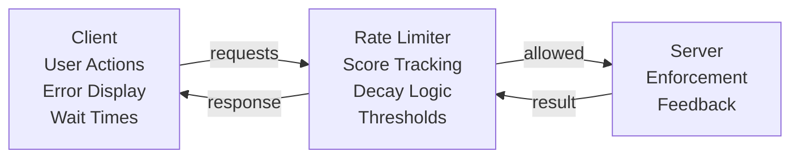

The signaling server uses a score-based rate limiting system. Each action adds points to a user's score, scores decay over time, and actions are blocked when the score exceeds a threshold.

## Overview

The rate limiting system uses a **score-based approach**:
- Each action adds points to a user's score
- Scores decay over time
- When a score exceeds a threshold, the action is blocked
- The server returns a retry delay so the client can show a helpful wait message

## Architecture



## Score-based algorithm

### How scores work (example)

```ts
interface ScoreData {
  score: number;
  lastUpdate: number;
}

const calculateCurrentScore = (scoreData: ScoreData, rule: RateLimitRule): number => {
  const now = Date.now();
  const timeSinceUpdate = now - scoreData.lastUpdate;
  const decayAmount = Math.floor(timeSinceUpdate / rule.scoreDecayMs);
  return Math.max(0, scoreData.score - decayAmount);
};
```

### Score decay

Scores decay automatically as time passes:
- **Decay rate**: configured as milliseconds per point
- **Fair recovery**: users recover quickly by waiting

## Client-side integration

When rate limited, clients receive structured error info:

```ts
interface RateLimitError {
  error: "rate_limited";
  retryAfterMs: number;
  currentScore: number;
  maxScore: number;
  message: string;
}
```

Example payload:

```json
{
  "error": "rate_limited",
  "retryAfterMs": 3000,
  "currentScore": 12,
  "maxScore": 10,
  "message": "You're doing things too quickly. Please wait 3 seconds."
}
```

## Debugging

If you add debug endpoints for rate limiting, you can use them to inspect scores and rules. If you're troubleshooting chat/join issues, also see the main [Troubleshooting](/docs/guide/troubleshooting) page.
